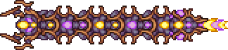
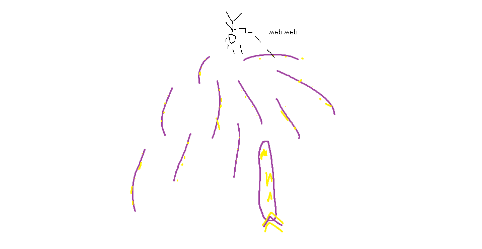

## Astrum Deus

*"May the stars guide your way."*

* **Armor Sets:**

    * **Any class**: Reaver, Chlorophyte.

    * **Mage**: Spectre.

* **Weapon Loadouts:**

    * **Ranged**: Conclave Crossfire, The Ballista, Snowman Cannon. Terra Ammo.

    * **Melee**: Terra Edge, *Terra Blade*, Holiday Halberd, True Forbidden Oathblade, Paladin's Hammer.

    * **Mage**: Undine's Retribution, Primordial Earth, Terra Ray.

    * **Summoner**: Entropy's Vigil, Raven Staff, Dreadmine Staff, Sun God Staff.

    * **Throwing**: Pwnagehammer, Brimblade.

* **General Accessories:**

    * Angel Treads, Deific Amulet, Asgard's Valor, MOAB, Frog Leg, The Community, Siren’s Heart.

* **Class Specific Accessories:**

    * **Ranged**: Ranger Emblem, Magic Quiver.

    * **Melee**: Warrior Emblem, Mechanical Glove, Bloody Worm Scarf.

    * **Mage**: Sorcerer Emblem, Mana Flower (optional).

    * **Summoner**: Statis' Blessing.

    * **Throwing**: Statis' Ninja Belt.

* **Strategy:**

    * Have one or two very long bridges. Whenever a worm gets close to you jump up as high as you can with MOAB and either dash/RoD away when the worms try to jump up to meet you. Be careful when doubling back on yourself, there will probably be a lot of orbs left behind where you had been running. Beware of the main worm getting faster as you deal damage to him.

<iframe width="620" height="315" src="https://www.youtube.com/embed/_c5wqS9DR5c" frameborder="0" allowfullscreen></iframe>

