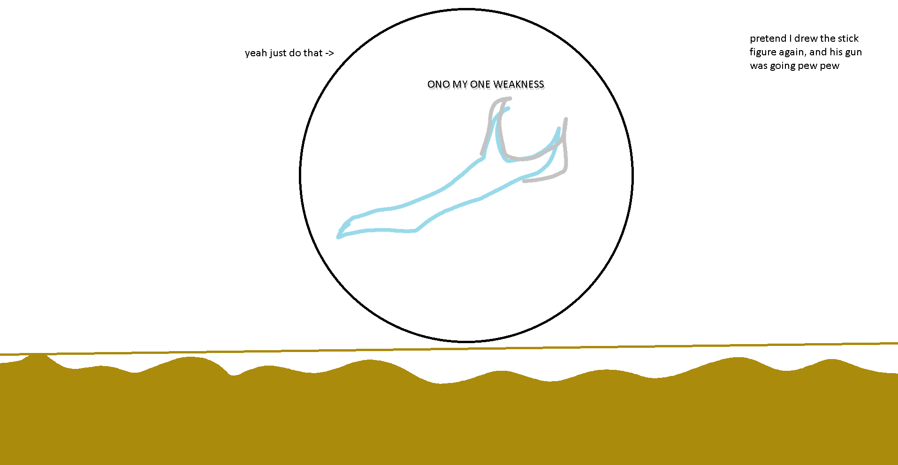

## Aquatic Scourge

*"The sulphuric sand stirs…"*

* **Armor Sets:**

    * **Any class**: Titanium, Daedalus, Frost.

* **Weapon Loadouts:**

    * **Ranged**: Archerfish, Megashark, Flarewing Bow. Ichor/Verium Ammo.

    * **Melee**: Trinity, *Icebreaker*, Forbidden Oathblade, Dao of Pow.

    * **Mage**: Golden Shower, Meteor Staff, *Death Valley Duster*, Gleaming Magnolia, SHPC, Magical Harp, Relic of Ruin.

    * **Summoner**: Ancient Ice Chunk, Optic Staff.

    * **Throwing**: Brimblade, Ice Star.

* **General Accessories:**

    * Frostspark Boots, Ankh Shield, Honey Dew, Deific Amulet, MOAB, Counter Scarf, Laudanum, Siren's Heart

* **Class Specific Accessories:**

    * **Ranger**: Ranger Emblem, Magic Quiver.

    * **Melee**: Warrior Emblem, Bloody Worm Scarf.

    * **Mage**: Sorcerer Emblem, Mana Flower (optional)

    * **Summoner**: Summoner Emblem,Spirit Generator (optional), Papyrus Scarab.

    * **Throwing**: Raider's Talisman.

* **Strategy:**

    * Spin in either circles or figure eights, and be careful of poison clouds. The longer you can make each circle take then the less likely you'll have to deal with the clouds. AS’s body inflicts venom on hit, so having a honey dew you can toggle on and off to remove the debuff may be useful.

<iframe width="620" height="315" src="https://www.youtube.com/embed/J6PviTYtr0A" frameborder="0" allowfullscreen></iframe>

