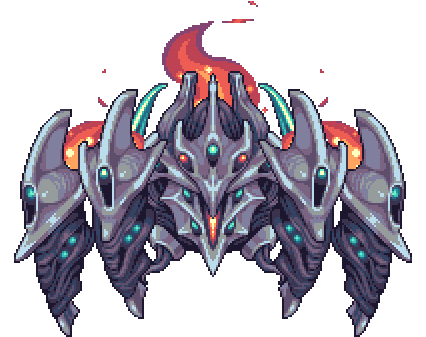

## [Astrum Aureus](https://calamitymod.gamepedia.com/Astrum_Aureus)

*"A titanic cyborg infected by a star-borne disease..."* 

    
* **Armor Sets:**

    * **Any class**: [Titanium](https://terraria.gamepedia.com/Titanium_armor), [Reaver](https://calamitymod.gamepedia.com/Reaver_armor), [Chlorophyte](https://terraria.gamepedia.com/Chlorophyte_armor).
    
    * **Mage**: [Spectre](https://terraria.gamepedia.com/Spectre_armor).

    * **Summoner**: [Spooky](https://terraria.gamepedia.com/Spooky_armor)

* **Weapon Loadouts:**

    * **Ranged**: [*The Ballista*](https://calamitymod.gamepedia.com/The_Ballista), [Megalodon](https://calamitymod.gamepedia.com/Megalodon), [Conclave Crossfire](https://calamitymod.gamepedia.com/Conclave_Crossfire).[Icicle](https://calamitymod.gamepedia.com/Icicle_Arrow)/[Ichor](https://terraria.gamepedia.com/Ichor_Arrow)/[Holy Arrows](https://terraria.gamepedia.com/Holy_Arrow), [Chlorophyte](https://terraria.gamepedia.com/Chlorophyte_Bullet)/[Ichor](https://terraria.gamepedia.com/Ichor_Bullet)/[Terra Bullets](https://calamitymod.gamepedia.com/Terra_Bullet).

    * **Melee**: [Terra Shiv](https://calamitymod.gamepedia.com/Terra_Shiv)/[Edge](https://calamitymod.gamepedia.com/Terra_Edge)/[Blade](https://terraria.gamepedia.com/Terra_Blade), [Terra Lance](https://calamitymod.gamepedia.com/Terra_Lance), [*True Ark of the Ancients*](https://calamitymod.gamepedia.com/True_Ark_of_the_Ancients), [True Forbidden Oathblade](https://calamitymod.gamepedia.com/True_Forbidden_Oathblade), [Tyrant Yharim's Ultisword](https://calamitymod.gamepedia.com/Tyrant_Yharim%27s_Ultisword).

    * **Mage**: [Blizzard Staff](https://terraria.gamepedia.com/Blizzard_Staff), [Undine's Retribution](https://terraria.gamepedia.com/Undine%27s_Retribution), [Tears of Heaven](https://calamitymod.gamepedia.com/Tears_of_Heaven), [Primordial Earth](https://calamitymod.gamepedia.com/Primordial_Earth), [Everglade Spray](https://calamitymod.gamepedia.com/Everglade_Spray).

    * **Summoner**: [Entropy's Vigil](https://calamitymod.gamepedia.com/Entropy%27s_Vigil), [Sun God Staff](https://calamitymod.gamepedia.com/Sun_God_Staff), [Dreadmine Staff](https://calamitymod.gamepedia.com/Dreadmine_Staff), [Cryogenic Staff](https://calamitymod.gamepedia.com/Cryogenic_Staff).

    * **Rogue**: [Ballistic Poison Bomb](https://calamitymod.gamepedia.com/Ballistic_Poison_Bomb), [Duststorm in a Bottle](https://calamitymod.gamepedia.com/Duststorm_in_a_Bottle), [Brackish Flask](https://calamitymod.gamepedia.com/Brackish_Flask).
    
* **General Accessories:**

    * [Angel Treads](https://calamitymod.gamepedia.com/Angel_Treads), [Deific Amulet](https://calamitymod.gamepedia.com/Deific_Amulet), [Asgard's Valor](https://calamitymod.gamepedia.com/Asgard%27s_Valor)/[Tabi+](https://terraria.gamepedia.com/Tabi), [The Community](https://calamitymod.gamepedia.com/The_Community), [Siren's Heart](https://calamitymod.gamepedia.com/Siren's_Heart), [Frog Leg](https://calamitymod.gamepedia.com/Frog_Leg)/[Aero Stone](https://calamitymod.gamepedia.com/Aero_Stone). [Aureate Booster+](https://calamitymod.gamepedia.com/Wings)/[MOAB](https://calamitymod.gamepedia.com/MOAB).

* **Class Specific Accessories:**

    * **Ranged**: [Daedalus Emblem](https://calamitymod.gamepedia.com/Daedalus_Emblem), [Magic Quiver](https://terraria.gamepedia.com/Magic_Quiver).

    * **Melee**: [Mechanical Glove](https://terraria.gamepedia.com/Mechanical_Glove), [Bloody Worm Scarf](https://calamitymod.gamepedia.com/Bloody_Worm_Scarf), [Celestial Shell](https://terraria.gamepedia.com/Celestial_Shell).

    * **Mage**: [Celestial Emblem](https://terraria.gamepedia.com/Celestial_Emblem), [Mana Flower](https://terraria.gamepedia.com/Mana_Flower) (optional).

    * **Summoner**: [Statis' Blessing](https://calamitymod.gamepedia.com/Statis%27_Blessing).

    * **Rogue**: [Rogue Emblem](https://calamitymod.gamepedia.com/Rogue_Emblem), [Raider's Talisman](https://calamitymod.gamepedia.com/Raider%27s_Talisman), [Statis' Ninja Belt](https://calamitymod.gamepedia.com/Statis%27_Ninja_Belt).

* **Strategies:**

    * Stay **away** from him, move up and down. Place walls on Rev+ because of sudoku bombers. Circles can work too, but the best strat is just running away while constantly keeping him on screen. Using any kind of homing is generally not recommended on Rev+ because of aforementioned sudoku commiters that try to blast your face for major damage. If you do trigger them - try to let them smash into walls so they explode peacefully.

<iframe width="620" height="315" src="https://www.youtube.com/embed/AS9U_DkcGyw" frameborder="0" allowfullscreen></iframe>

