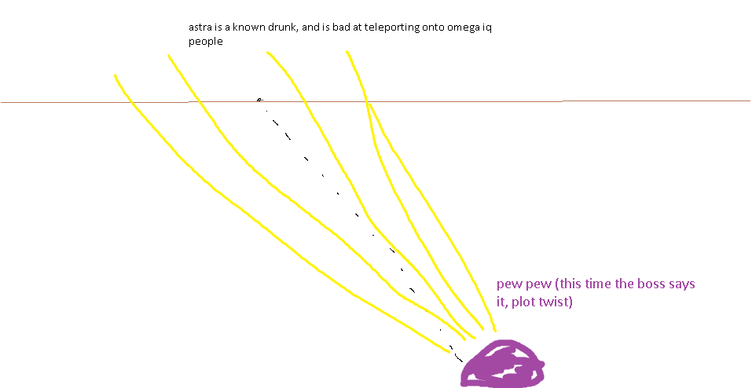

## Astrageldon Slime

*"A mass of star jelly falls from the sky!"* 

* **Armor Sets:**

    * **Any class**: Reaver, Chlorophyte.

    * **Mage**: Spectre.

* **Weapon Loadouts:**

    * **Ranged**: *Conclave Crossfire*, Megalodon. Ichor/Terra Ammo.

    * **Melee**: Tyrant Yharim's Ultisword, *Terra Blade*, True Forbidden Oathblade.

    * **Mage**: Primordial Earth, Everglade Spray, Tears of Heaven, Undine's Retribution.

    * **Summoner**: Entropy's Vigil, Raven Staff, Dreadmine Staff, Sun God Staff.

    * **Throwing**: Ballistic Poison Bomb, Brackish Flask.

* **General Accessories:**

    * Angel Treads, Deific Amulet, Asgard's Valor, MOAB, The Community, Siren’s Heart.

* **Class Specific Accessories:**

    * **Ranged**: Ranger Emblem, Magic Quiver.

    * **Melee**: Warrior Emblem, Mechanical Glove, Bloody Worm Scarf.

    * **Mage**: Sorcerer Emblem, Mana Flower (optional).

    * **Summoner**: Statis' Blessing.

    * **Throwing**: Statis' Ninja Belt.

* **Strategies:**

    * Stay **away** from him, move up and down. Do not put a wall between you and him, he completely ignores those with his shots and can warp like KS. Circles can work too, but move slowly if you're doing them. Best strat is just running away while constantly keeping him on screen because now he can teleport. Laser barrages were replaced with shotgun blasts which shouldn’t pose any threat if you’re not standing still.

<iframe width="620" height="315" src="https://www.youtube.com/embed/R7d6CT7VXlI" frameborder="0" allowfullscreen></iframe>

