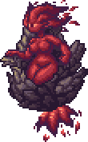
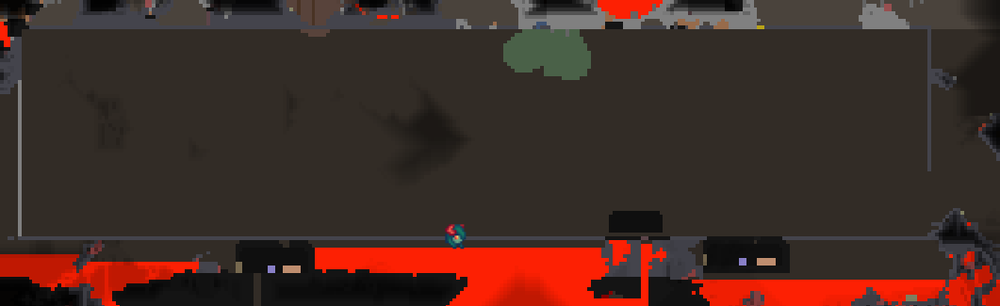
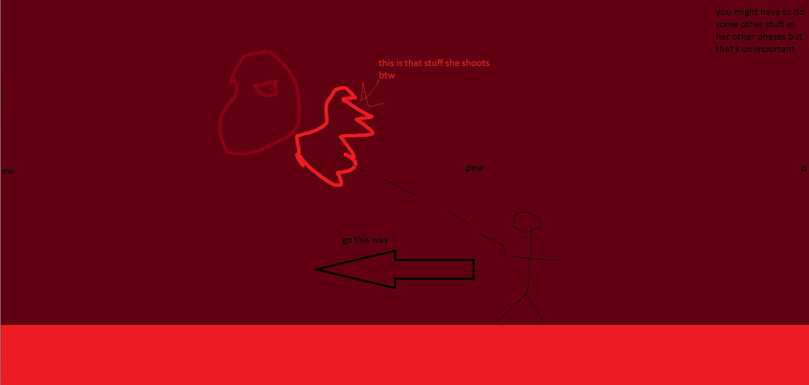

## Brimstone Elemental

*"A fallen deity resides in the depths of hell..."*

* **Armor Sets:**

    * **Any class**: Daedalus, Titanium.

* **Weapon Loadouts:**

    * **Ranged**: Megashark, Flarewing Bow, Butcher, Effluvium Bow. Ichor/Crystal Ammo.

    * **Melee**: Darklight Greatsword, Icebreaker.

    * **Mage**: Golden Shower, *Shadecrystal Barrage*, Gleaming Magnolia, SHPC.

    * **Summoner**: Ancient Ice Chunk.

    * **Throwing**: Spear of Paleolith, Ice Star, Ichor Spear.

    * **Support Weapons**: Slag Magnum, Golden Shower.

* **General Accessories:**

    * Frostspark Boots, Ankh Shield, Deific Amulet, Soul of Cryogen+, Counter Scarf, Laudanum, Siren's Heart

* **Class Specific Accessories:**

    * **Ranger**: Ranger Emblem, Magic Quiver.

    * **Melee**: Warrior Emblem, Bloody Worm Scarf.

    * **Mage**: Sorcerer Emblem, Celestial Cuffs+, Mana Flower (optional).

    * **Summoner**: Summoner Emblem, Papyrus Scarab, Spirit Generator.

    * **Throwing**: Raider's Talisman.

* **Strategy:**

    * Move away from her during her charging phases. Do circles around her during her projectile-spam phase. When she enters her shell, move in a circle/semicircle and don't move too far away from her. Use RoD to avoid her shell phase barrage attacks in case you get stuck in a corner. Also avoid killing Brimlings on Revengeance+ because if you kill one - another spawns in and ruins your day.

<iframe width="620" height="315" src="https://www.youtube.com/embed/L1DSn7ooaY8" frameborder="0" allowfullscreen></iframe>

