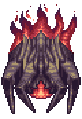

## Calamitas

*"Tonight is going to be a horrific night..."*

* **Armor Sets:**

    * **Any class**: Daedalus, Titanium, Chlorophyte.

* **Weapon Loadouts:**

    * **Ranged**: Megashark, Slag Magnum, *Chlorophyte Shotbow*. Ichor Ammo.

    * **Melee**: *Terra Blade*, True Forbidden Oathblade, True Caustic Edge, Pwnagehammer.

    * **Mage**: Brimrose Staff, Gleaming Magnolia, Relic of Ruin (for brothers), SHPC.

    * **Summoner**: Ancient Ice Chunk, Optic Staff, Sun God Staff.

    * **Throwing**: Spear of Paleolith, Ice Star, Ichor Spear, Brimblade.

* **General Accessories:**

    * Angel Treads, Abaddon, Ankh Shield, Deific Amulet, Soul of Cryogen+, Counter Scarf, Laudanum, Siren's Heart

* **Class Specific Accessories:**

    * **Ranger**: Ranger Emblem, Magic Quiver.

    * **Melee**: Warrior Emblem, Mechanical Glove, Bloody Worm Scarf.

    * **Mage**: Sorcerer Emblem, Mana Flower (optional)

    * **Summoner**: Summoner Emblem, Papyrus Scarab.

    * **Throwing**: Raider's Talisman.

* **Strategy:**

    * Move in wide circles around Calamitas' first phase, it may take a few attempts to find the perfect way to move for your circle. Once second phase hits, abort circling and start running away (pic related) until brothers die, then keep circling if she’s not trying to spam splitting lasers (otherwise just keep running). On Rev+, save rage/adrenaline for brothers. When brothers spawn, prepare to use your RoD (if you have one) to avoid the possibility of them screwing you over upon spawning.

<iframe width="620" height="315" src="https://www.youtube.com/embed/HieMozWjIyw" frameborder="0" allowfullscreen></iframe>

