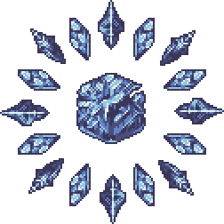
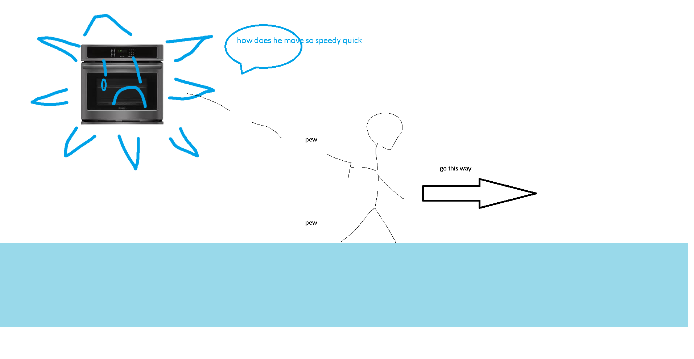

## Cryogen

*"Magic of an ancient ice castle…"*

* **Armor Sets:**

    * **Any class**: Titanium, Frost.

* **Weapon Loadouts:**

    * **Ranged**: *Archerfish*, Onyx Blaster, Flarewing Bow, Slag Magnum, Butcher. Ichor Ammo.

    * **Melee**: True Caustic Edge, Ball'o’Fugu, Bananarang, Amarok.

    * **Mage**: Golden Shower, Hell Burst, Crystal Storm, Relic of Ruin.

    * **Summoner**: Ancient Ice Chunk, Queen Spider Staff.

    * **Throwing**: Spear of Paleolith, Ichor Spear, Lionfish.

* **General Accessories:**

    * Frostspark Boots, Ankh Shield, Deific Amulet, Counter Scarf, Siren's Heart, Laudanum. Skyline Wings+.

* **Class Specific Accessories:**

    * **Ranged**: Ranger Emblem, Magic Quiver.

    * **Melee**: Warrior Emblem, Yoyo Bag, Bloody Worm Scarf.

    * **Mage**: Sorcerer Emblem, Mana Flower (optional).

    * **Summoner**: Summoner Emblem, Papyrus Scarab, Spirit Generator.

    * **Throwing**: Raider's Talisman.

* **Strategy:**

    * Keep your distance throughout the fight, only change directions if you have to. Once the second phase starts (you'll see the blizzard) immediately smash Torrential Tear, because you 100% don’t want to not see anything. Avoid being below Cryogen for extended periods of time, being under it makes it rain projectiles. On Rev+, save rage/adrenaline for the last phase to avoid it crashing into you.

<iframe width="620" height="315" src="https://www.youtube.com/embed/a2cO53tNCrU" frameborder="0" allowfullscreen></iframe>

