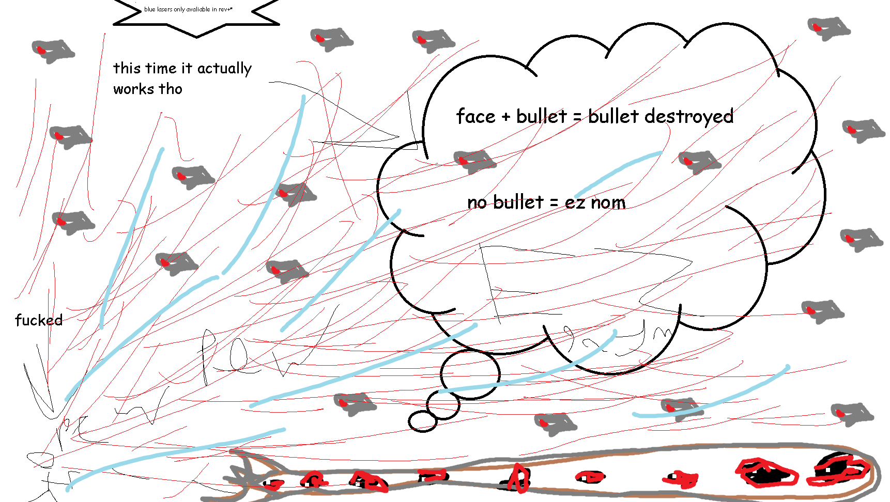

## The Destroyer

*"You feel vibrations from deep below…"*

* **Armor Sets:**

    * **Any class**: Daedalus, Titanium.

    * **Throwing**: Daedalus Facemask, Any chestplate, Fossil Greaves.
    
* **Weapon Loadouts:**

    * **Ranged**: Flarewing Bow, Onyx Blaster, Mineral Mortar, Megashark. Napalm/Ichor/Crystal ammo.

    * **Melee**: *Fetid Baghnakhs*, Darklight Greatsword, Trinity.

    * **Mage**: *Meteor Staff*, Death Valley Duster, Lazinator.

    * **Summoner**: Ancient Ice Chunk.

    * **Throwing**: Spear of Paleolith, *Ice Star*.

* **General Accessories:**

    * Frostspark Boots, Ankh Shield, Deific Amulet, Soul of Cryogen+, Frost Flare, Counter Scarf, Laudanum, Siren's Heart.

* **Class Specific Accessories:**

    * **Ranged**: Ranger Emblem, Magic Quiver.

    * **Melee**: Warrior Emblem, Bloody Worm Scarf.

    * **Mage**: Sorcerer Emblem, Celestial Cuffs, Mana Flower (optional).

    * **Summoner**: Summoner Emblem, Spirit Generator, Papyrus Scarab.

    * **Throwing**: Raider's Talisman.

* **Strategies:**

    * **Strategy 1 - "~~Skybridge walking~~ More like grav pot flying"**: grab a gravitation potion, go in biiig zigzags (vertical movement mostly), green lazers can be juked somewhat like skeletron's skulls, that's about it for the strat. 

    * ~~**Strategy 2 - "Melee 2: Electric Boogaloo"**: grab ALL the melee speed accessories, reforge them to Violent, grab Fetid Baghnakhs, summon the worm, jump into him while he's still coiled, proceed to shred him at the speed of 60 attacks per second.~~ It's dead.

<iframe width="620" height="315" src="https://www.youtube.com/embed/2ncBGKFcDbc" frameborder="0" allowfullscreen></iframe>

