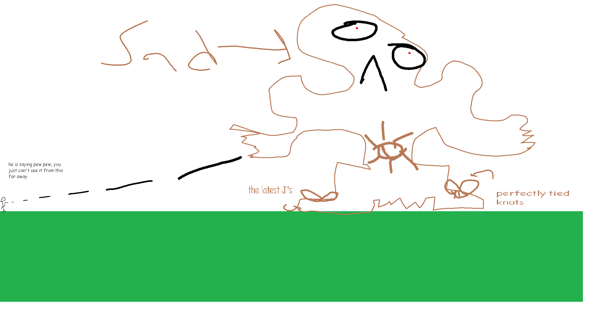

## Golem

*"The stone-faced ritualistic idol of lihzahrdian tribe…"*

* **Armor Sets:**

    * **Any class**: Reaver, Chlorophyte.

    * **Mage**: Spectre.

* **Weapon Loadouts:**

    * **Ranged**: Conclave Crossfire, Megalodon, Spectre Rifle. Terra Ammo.

    * **Melee**: Terra Edge, Tyrant Yharim's Ultisword, Mantis Claws, *Terra Blade*, True Forbidden Oathblade.

    * **Mage**: Undine's Retribution, Everglade Spray, Primordial Earth, Tears of Heaven, Astral Staff.

    * **Summoner**: Entropy's Vigil, Raven Staff, Dreadmine Staff, Sun God Staff.

    * **Throwing**: Ballistic Poison Bomb, Brackish Flask.

* **General Accessories:**

    * Angel Treads, Deific Amulet, Asgard's Valor, MOAB, Void of Calamity+, The Community, Siren's Heart.

* **Class Specific Accessories:**

    * **Ranged**: Ranger Emblem, Magic Quiver.

    * **Melee**: Warrior Emblem/Mechanical Glove, Bloody Worm Scarf.

    * **Mage**: Sorcerer Emblem.

    * **Summoner**: Statis' Blessing.

    * **Throwing**: Statis' Ninja Belt.

* **Strategies:**

    * By using actuators, you can displace the blocks under the altar to take it without having previously killing Golem. This may need to be done if you have a small temple arena. Move left and right above Golem and try to time your direction changes with his fists retracting.

<iframe width="620" height="315" src="https://www.youtube.com/embed/hPEQ2gVRdqU" frameborder="0" allowfullscreen></iframe>

