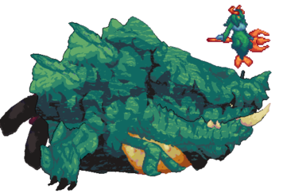
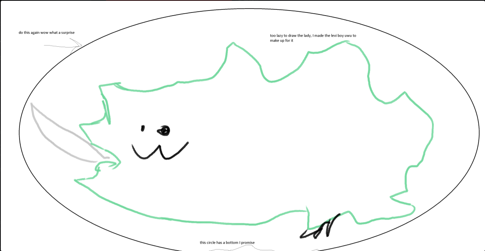

## Leviathan/Siren

*"Take care not to disturb the deep waters of this world."*

* **Armor Sets:**

    * **Any class**: Reaver, Chlorophyte.

    * **Mage**: Spectre.

* **Weapon Loadouts:**

    * **Ranged**: Conclave Crossfire, Megalodon, Flak Kraken, *The Ballista*. Chlorophyte/Ichor/Terra Ammo.

    * **Melee**: *Terra Blade*, True Forbidden Oathblade, Vampire Knives.

    * **Mage**: Everglade Spray, Undine's Retribution, Tears of Heaven, Primordial Earth, Gleaming Magnolia?

    * **Summoner**: Entropy's Vigil, Dreadmine Staff, Sun God Staff.

    * **Throwing**: Ballistic Poison Bomb, Brimblade.

* **General Accessories:**

    * Angel Treads, Deific Amulet, Asgard's Valor, MOAB, Siren’s Heart, Abyssal Diving Gear, Void of Extinction, Aquatic Emblem.

* **Class Specific Accessories:**

    * **Ranged**: Ranger Emblem, Magic Quiver.

    * **Melee**: Warrior Emblem, Mechanical Glove, Bloody Worm Scarf.

    * **Mage**: Sorcerer Emblem, Mana Flower (optional).

    * **Summoner**: Statis' Blessing.

    * **Throwing**: Statis' Ninja Belt.

* **Strategies:**

    * On Rev or below, prioritize the siren first before dealing with the leviathan, vice versa for Death. MOAB or Frog Leg is very good for Leviathan to help you fall faster than her once she's enraged (which happens when Siren is dead/always on death.). Put your map in background mode to keep an eye on the siren. You should also note where the siren lure appeared and keep her inside your circles.  
