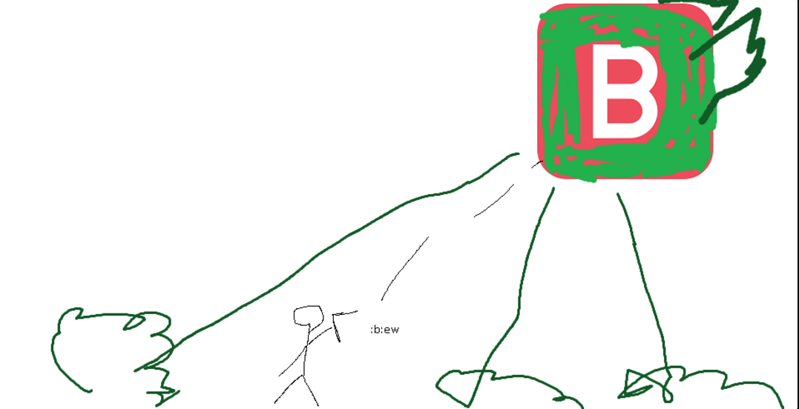

## Plaguebringer Goliath

*"The metallic smell of rusted iron and decay fills the air…"*

* **Armor Sets:**

    * **Any class**: Ataxia.

* **Weapon Loadouts:**

    * **Ranged**: Conclave Crossfire, Helstorm, *Greatbow of Turmoil*. Chloro/Terra Ammo.

    * **Melee**: Soul Harvester, Tyrant Yharim's Ultisword, *Vampire Knives*, Hellfire Flamberge.

    * **Mage**: Undine's Retribution, Everglade Spray, Primordial Earth, Tears of Heaven, Razorpine.

    * **Summoner**: Entropy's Vigil, Raven Staff, Dreadmine Staff, Sun God Staff.

    * **Throwing**: Ballistic Poison Bomb, Brackish Flask, True Paladin's Hammer, Flame Scythe.

* **General Accessories:**

    * Angel Treads, Asgard's Valor, Discordian Wings/MOAB, The Community, Siren’s Heart, Alchemical Flask, Honey Dew, Celestial Jewel, Void of Extinction.

* **Class Specific Accessories:**

    * **Ranged**: Daedalus Emblem, Ranger Emblem, Magic Quiver.

    * **Melee**: Warrior Emblem, Mechanical Glove, Bloody Worm Scarf.

    * **Mage**: Sigil of Calamitas.

    * **Summoner**: Statis' Blessing.

    * **Throwing**: Statis' Ninja Belt.

* **Strategies:**

    * Similar movement to Queen Bee. Hope for PBG charging you, it's the best time you really ever get to deal damage. When she’s firing missiles from her charges don’t move much (they’re too slow to be a real threat and you’ll have an easier time aiming at the boss). PBG despawns really easily so avoid abusing vertical movement if fighting on the surface. 

<iframe width="620" height="315" src="https://www.youtube.com/embed/L4-MPvkDfH0" frameborder="0" allowfullscreen></iframe>

