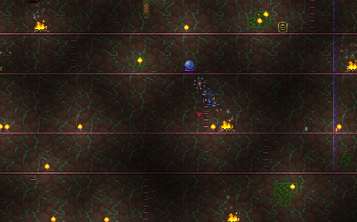
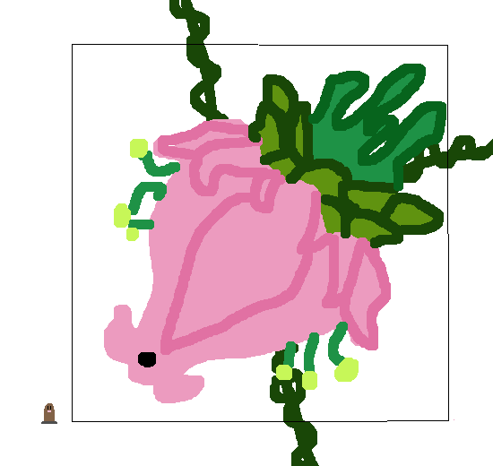

## Plantera

*"The jungle grows restless…"*

* **Armor Sets:**

    * **Any class**: Daedalus, Chlorophyte, Titanium.

    * **Mage**: Spectre.

* **Weapon Loadouts:**

    * **Ranged**: Megashark, *Barinautical, Chlorophyte Shotbow*. Ichor Ammo.

    * **Melee**: Fetid Baghnakhs, Terra Blade, Submarine Shocker, *True Forbidden Oathblade*.

    * **Mage**: Infernal Rift, Death Valley Duster, Relic of Ruin, Gleaming Magnolia, SHPC.

    * **Summoner**: Ancient Ice Chunk, Entropy's Vigil, Optic Staff, Sun God Staff.

    * **Throwing**: Spear of Paleolith, Ice Star, Ichor Spear, Brimblade.

* **General Accessories:**

    * Angel Treads, Deific Amulet, Ankh Shield, MOAB, The Community, Siren's Heart.

* **Class Specific Accessories:**

    * **Ranged**: Ranger Emblem.

    * **Melee**: Warrior Emblem, Mechanical Glove, Bloody Worm Scarf.

    * **Mage**: Sorcerer Emblem, Mana Flower.

    * **Summoner**: Papyrus Scarab, Summoner Emblem.

    * **Throwing**: Raider's Talisman.

* **Strategy:**

    * Arena (but 3x bigger): 

    * If it doesn't count as jungle - use actuators on jungle mud.

    * Special note for arenas: they should have a big open space on the bottom so gay pink balls of face-eating fall down and don't come back to haunt your dreams. Just like hooks.

    * Do circles in phase 1, run away in phase 2 (and then loop back in an oval once you run out of space). Beware of the spores she shoots in phase 2, they are very small and easy to miss.

<iframe width="620" height="315" src="https://www.youtube.com/embed/nJJJ5F2i6eQ" frameborder="0" allowfullscreen></iframe>

