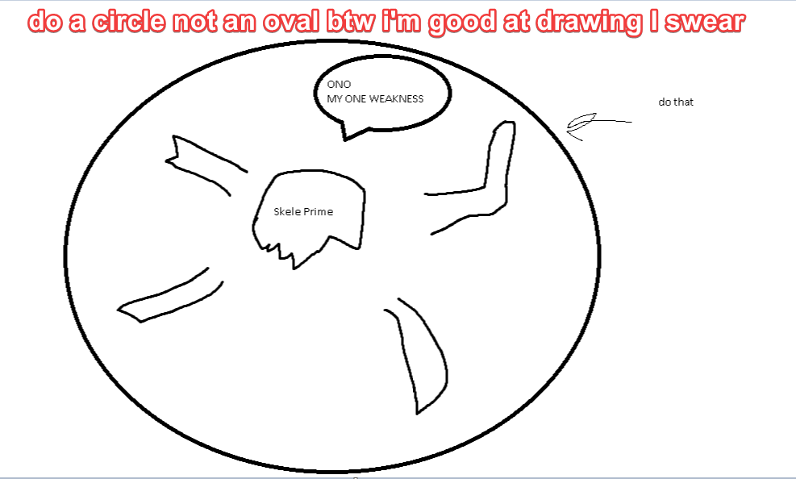

## Skeletron Prime

*"You feel the air getting colder around you…"*

* **Armor Sets**:

    * **Any class**: Daedalus, Titanium, Frost.

* **Weapon Loadouts:**

    * **Ranged**: *Barinautical*, *Clockwork Assault Rifle*, Megashark, Butcher. Ichor Bullets.

    * **Melee:** Submarine Shocker, *Darklight Greatsword*, Pwnagehammer.

    * **Mage**: Golden Shower, Shadecrystal Barrage, Meteor Staff, Gleaming Magnolia.

    * **Summoner**: Ancient Ice Chunk, Optic Staff.

    * **Throwing**: Ice Star, Spear of Paleolith, Ichor Spear.

    * **Support Weapons**: Slag Magnum, Golden Shower.

* **General Accessories:**

    * Frostspark Boots, Ankh Shield, Deific Amulet, Soul of Cryogen+, Counter Scarf, Laudanum, Siren's Heart, Frog Leg/MOAB.

* **Class Specific Accessories:**

    * **Ranged**: Ranger Emblem, Magic Quiver.

    * **Melee**: Warrior Emblem, Bloody Worm Scarf.

    * **Mage**: Sorcerer Emblem, Mana Flower (optional).

    * **Summoner**: Summoner Emblem, Papyrus Scarab.

    * **Throwing**: Raider's Talisman.

* **Strategy:**

    * On Rev or below, spin in wide circles around him until he falls over. On Death, either do your best to avoid breaking the laser hand or use daedalus armor set's ability to flip gravity to fly away during his spinning attack. Regardless of difficulty - keep your distance.

<iframe width="620" height="315" src="https://www.youtube.com/embed/w4g6MCvKVZU" frameborder="0" allowfullscreen></iframe>

