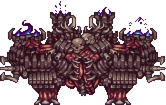
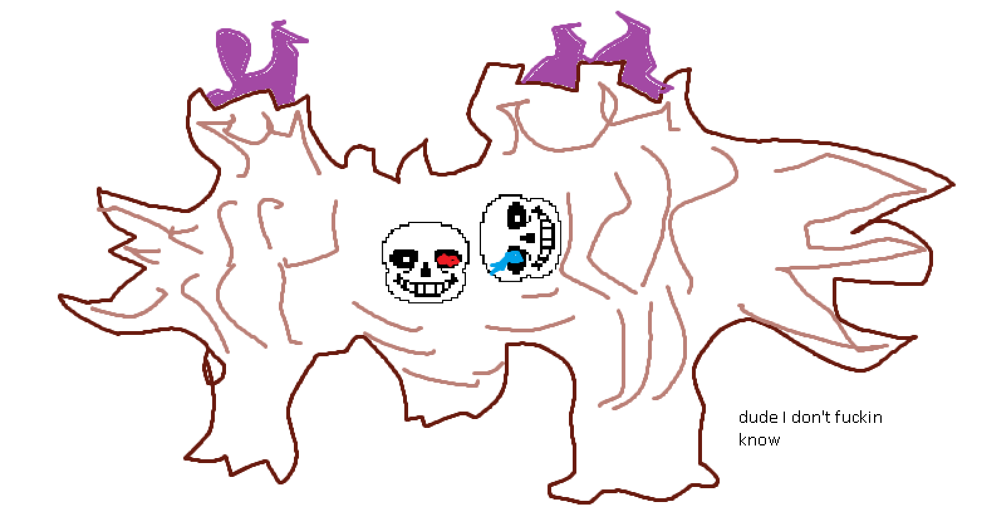

### Ravager

*"An ancient automaton is roaming the land…"*

* **Armor Sets**:

    * **Any class**: Ataxia.

* **Weapon Loadouts:**

    * **Ranged**: Conclave Crossfire, Helstorm, Ballista, Malevolence. Terra Ammo.

    * **Melee**: Omniblade, *Terra Lance*, True Forbidden Oathblade, Hellfire Flamberge.

    * **Mage**: Undine's Retribution, Everglade Spray, Primordial Earth, Plague Staff, Forbidden Sun.

    * **Summoner**: Entropy's Vigil, Raven Staff, Dreadmine Staff, Sun God Staff.

    * **Throwing**: Brackish Flask, Malachite, True Paladin's Hammer, Duststorm in a Bottle(phase 1 only).

* **General Accessories:**

    * Angel Treads, Asgard's Valor, Deific Amulet, Void of Extinction, Discordian Wings/MOAB, The Community, Siren’s Heart.

* **Class Specific Accessories:**

    * **Ranged**: Daedalus Emblem, Ranger Emblem, Magic Quiver.

    * **Melee**: Warrior Emblem, Mechanical Glove, Bloody Worm Scarf.

    * **Mage**: Sigil of Calamitas.

    * **Summoner**: Statis' Blessing.

    * **Throwing**: Statis' Ninja Belt.

* **Strategy:**

    * Ravager's two Flame Pillars, every 6 seconds (might get more frequent as the fight goes on?), teleport ~10 tiles to your left and right. The position is determined just before they teleport, so lateral movement can result in one of them materializing on top of you. Keep him on the edge of your screen because if you come closer you risk being bashed with his warpfists, and if you go farther you’ll be petrified (naturally you don’t want this).

<iframe width="620" height="315" src="https://www.youtube.com/embed/3kbFy0E5uss" frameborder="0" allowfullscreen></iframe>

