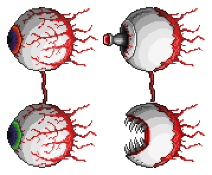
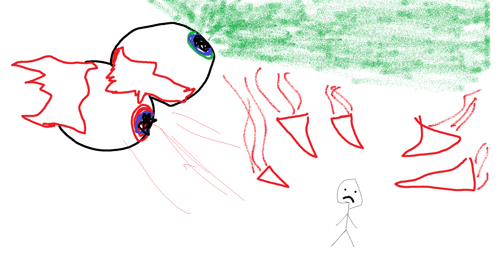

## The Twins

*"This is going to be a terrible night…"*

* **Armor Sets:**

    * **Any class**: Daedalus, Titanium, Frost.

* **Weapon Loadouts:**

    * **Ranged**: Megashark, *Clockwork Assault Rifle*, Flarewing Bow, Effluvium Bow, Butcher. Ichor Ammo.

    * **Melee**: Darklight Greatsword, Icebreaker, Forbidden Oathblade.

    * **Mage**: Golden Shower, Shadecrystal Barrage, Gleaming Magnolia, Relic of Ruin, SHPC.

    * **Summoner**: Ancient Ice Chunk.

    * **Throwing**: Ice Star, Spear of Paleolith, Ichor Spear.

    * **Support Weapons**: Slag Magnum, Golden Shower.

* **General Accessories:**

    * Frostspark Boots, Ankh Shield, Deific Amulet, Soul of Cryogen+, Counter Scarf, Laudanum, Siren's Heart

* **Class Specific Accessories:**

    * **Ranged**: Ranger Emblem, Magic Quiver.

    * **Melee**: Warrior Emblem, Bloody Worm Scarf.

    * **Mage**: Sorcerer Emblem, Mana Flower (optional).

    * **Summoner**: Summoner Emblem, Papyrus Scarab.

    * **Throwing**: Raider's Talisman.

* **Strategy:**

    * I dunno tbh, the entire boss consists of you flipping gravity non-stop and shooting it like pew-pew. Kill either of the eyes first, both of them are annoying to dodge in second phase. Retinazer's lasers can be dodged by gently tapping your jump button with wings (you're gonna reuse that on SCal or Clone eventually).

<iframe width="620" height="315" src="https://www.youtube.com/embed/bqoqpSraFao" frameborder="0" allowfullscreen></iframe>

