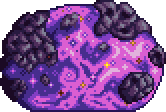

## Astrum Aureus (Rematch)

*"Astrageldon hears an whomst'd've..."* 

* **Armor Sets:**

    * **Any class**: Lunar

    * **Throwing**: Xeroc.

* **Weapon Loadouts:**

    * **Ranged**: *Onyx Chain Blaster*, Astreal Defeat, Shredder. Holy Fire/Terra Ammo.

    * **Melee**: Ark of the Elements, Elemental Shiv, *Galactus Blade, Omega Biome Blade.*

    * **Mage**: Nuclear Fury, Arch Amaryllis.

    * **Summoner**: Elemental Axe, Stardust Dragon, Energy Staff.

    * **Throwing**: Elemental Disk, Xeroc Pitchforks.

* **General Accessories:**

    * Seraph Tracers, Asgard's Valor, Absorber, The Community, Deific Amulet, Void of Extinction.

* **Class Specific Accessories:**

    * **Ranged**: Daedalus Emblem, Ranger Emblem.

    * **Melee**: Bloody Worm Scarf, Mechanical Glove.

    * **Mage**: Sigil of Calamitas, Eldritch Soul Artifact.

    * **Summoner**: Statis' Blessing, Statis’ Curse.

    * **Throwing**: Statis' Ninja Belt.

* **Strategy:**

    * The same shit you did when he wasn't buffed, except a fireball will now demolish your face completely.
