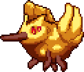

## Bumblebirb

*"A failed Yharon clone is bumbling about in the jungle…"*

* **Armor Sets:**

    * **Any class**: Tarragon, Bloodflare, God Slayer.

* **Weapon Loadouts:**

    * **Ranged**: *Phangasm*, SDFMG, Minigun. Vanquisher Arrows. Holy Fire Bullets.

    * **Melee**: Galaxia, Enforcer.

    * **Mage**: *Magnetic Meltdown*, *Alpha Ray*, Venusian Trident.

    * **Summoner**: Staff of the Mechworm, Calamari's Lament, Ethereal Subjugator.

    * **Throwing**: Valediction, Executioner's Blade.

* **General Accessories:**

    * Seraph Tracers+, Asgardian Aegis, Core of the Blood God, The Community, Reaper Tooth Necklace, The Sponge, Rampart of Deities, Dimensional Soul Artifact.

* **Class Specific Accessories:**

    * **Ranged**: Elemental Quiver.

    * **Melee**: Elemental Gauntlet.

    * **Mage**: Ethereal Talisman, Eldritch Soul Artifact.

    * **Summoner**: Statis' Blessing, Statis’ Curse, Statis’ Belt of Curses.

    * **Throwing**: Statis' Ninja Belt, Statis’ Belt of Curses, Nanotech.

* **Strategy:**

    * The entire fight is just butchering a steroided Mothron, so do what you would usually do while farming eclipses. He bumbles.

<iframe width="620" height="315" src="https://www.youtube.com/embed/FoetT2WPbko" frameborder="0" allowfullscreen></iframe>

