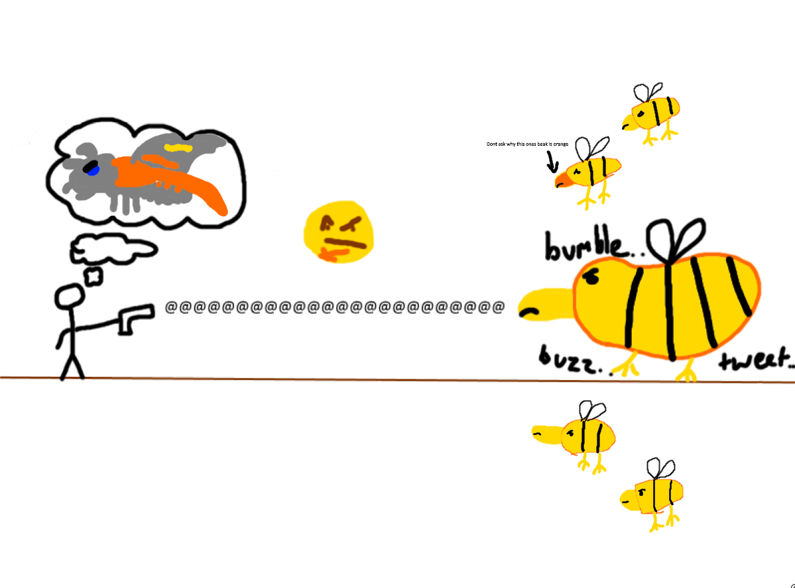

## [Bumblebirb](https://calamitymod.gamepedia.com/Bumblebirb)

*"A failed Yharon clone is bumbling about in the jungle…"*

* **Armor Sets:**

    * **Any class**: [Tarragon](https://calamitymod.gamepedia.com/Tarragon_armor), [Bloodflare](https://calamitymod.gamepedia.com/Bloodflare_armor), [Omega Blue](https://calamitymod.gamepedia.com/Omega_Blue_armor), [God Slayer](https://calamitymod.gamepedia.com/God_Slayer_armor).

* **Weapon Loadouts:**

    * **Ranged**: [*Phangasm*](https://calamitymod.gamepedia.com/Phangasm), [Alluvion](https://calamitymod.gamepedia.com/Alluvion), [SDFMG](https://calamitymod.gamepedia.com/SDFMG), [Minigun](https://calamitymod.gamepedia.com/Minigun). [Vanquisher Arrows](https://calamitymod.gamepedia.com/Vanquisher_Arrow). [Holy Fire Bullets](https://calamitymod.gamepedia.com/Holy_Fire_Bullet), [Hyperius Bullets](https://calamitymod.gamepedia.com/Hyperius_Bullet).

    * **Melee**: [Galaxia](https://calamitymod.gamepedia.com/Galaxia), [The Enforcer](https://calamitymod.gamepedia.com/The_Enforcer).

    * **Mage**: [*Magnetic Meltdown*](https://calamitymod.gamepedia.com/Magnetic_Meltdown), [Dark Spark](https://calamitymod.gamepedia.com/Dark_Spark), [Soul Piercer](https://calamitymod.gamepedia.com/Soul_Piercer).

    * **Summoner**: [Staff of the Mechworm](https://calamitymod.gamepedia.com/Staff_of_the_Mechworm), [Calamari's Lament](https://calamitymod.gamepedia.com/Calamari%27s_Lament), [Ethereal Subjugator](https://calamitymod.gamepedia.com/Ethereal_Subjugator).

    * **Rogue**: [Valediction](https://calamitymod.gamepedia.com/Valediction), [Executioner's Blade](https://calamitymod.gamepedia.com/Executioner%27s_Blade).

* **General Accessories:**

    * [Seraph Tracers](https://calamitymod.gamepedia.com/Seraph_Tracers)+, [Asgardian Aegis](https://calamitymod.gamepedia.com/Asgardian_Aegis), [Core of the Blood God](https://calamitymod.gamepedia.com/Core_of_the_Blood_God), [The Community](https://calamitymod.gamepedia.com/The_Community), [Reaper Tooth Necklace](https://calamitymod.gamepedia.com/Reaper_Tooth_Necklace), [The Sponge](https://calamitymod.gamepedia.com/The_Sponge), [Rampart of Deities](https://calamitymod.gamepedia.com/Rampart_of_Deities), [Dimensional Soul Artifact](https://calamitymod.gamepedia.com/Dimensional_Soul_Artifact), [Affliction](https://calamitymod.gamepedia.com/Affliction).

* **Class Specific Accessories:**

    * **Ranged**: [Elemental Quiver](https://calamitymod.gamepedia.com/Elemental_Quiver).

    * **Melee**: [Elemental Gauntlet](https://calamitymod.gamepedia.com/Elemental_Gauntlet).

    * **Mage**: [Ethereal Talisman](https://calamitymod.gamepedia.com/Ethereal_Talisman), [Eldritch Soul Artifact](https://calamitymod.gamepedia.com/Eldritch_Soul_Artifact).

    * **Summoner**: [Statis' Blessing](https://calamitymod.gamepedia.com/Statis%27_Blessing), [Statis’ Curse](https://calamitymod.gamepedia.com/Statis%27_Curse), [Statis’ Belt of Curses](https://calamitymod.gamepedia.com/Statis%27_Belt_of_Curses), [Profaned Soul Artifact](https://calamitymod.gamepedia.com/Profaned_Soul_Artifact).

    * **Rogue**: [Statis’ Belt of Curses](https://calamitymod.gamepedia.com/Statis%27_Belt_of_Curses), [Nanotech](https://calamitymod.gamepedia.com/Nanotech), [Eldritch Soul Artifact](https://calamitymod.gamepedia.com/Eldritch_Soul_Artifact).

* **Strategy:**

    * The entire fight is just butchering a steroided Mothron, so do what you would usually do while farming eclipses. He bumbles.

<iframe width="620" height="315" src="https://www.youtube.com/embed/FoetT2WPbko" frameborder="0" allowfullscreen></iframe>

