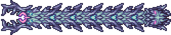
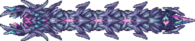

## Devourer of Gods

*"You are no god, but I shall feast upon your essence regardless!"*

* **Armor Sets**:

    * **Any class**: Tarragon, Bloodflare.

    * **Melee**: Ataxia.

* **Weapon Loadouts:**

    * **Ranged**: *Seadragon*, Claret Cannon, Daemon's Flame, Aether’s Whisper, Shredder. Elysian/Bloodflare Ammo.

    * **Melee**: Soul Edge, *Banshee Hook*, Holy Collider, Solar Flare, Lacerator (for Devourers of Thots).

    * **Mage**: *Mistlestorm*, *Aether's Whisper*, *Eidolic Wail*, Genisis.

    * **Summoner**: Cosmilamp, Calamari's Lament, Ethereal Subjugator.

    * **Throwing**: *Valediction*, Cosmic Kunai.

* **General Accessories:**

    * Seraph Tracers, Asgard's Valor/Elysian Aegis, Bloodflare Core, The Community, Void of Extinction, Astral Arcanum, Reaper Tooth Necklace.

* **Class Specific Accessories:**

    * **Ranged**: Daedalus Emblem.

    * **Melee**: Yharim's Insignia, Bloody Worm Scarf.

    * **Mage**: Sigil of Calamitas, Eldritch Soul Artifact.

    * **Summoner**: Statis' Blessing, Statis’ Curse.

    * **Throwing**: Statis' Ninja Belt, Eldritch Soul Artifact.

* **Weapon explanations (if required):**

    * **Ranged**: Claret Cannon requires Bloodflare armor, Aether's Whisper is best used with a lower platform made out of solid blocks (since it acts like a Plasma Rod).

    * **Melee**: Collider requires Melee speed overclocking and is extremely risky, Solar Flare is subpar to other weapons, if using Banshee Hook aim ahead of DoG to maximize dps.

* **Strategy:**
   * Make two skybridges.  
   * On Rev+, prioritize the Thots when they spawn; try to spawn them while the Devourer of Gods is in his grounded phase, as long as he is on-screen and below you he is harmless, meaning you can fly and dash diagonally to keep the Thots at a distance while you dispatch them, when the 2nd wave comes try to stack them together, this will make dealing with them easier. It's not a bad idea to use Adrenaline or Rage on the Thots, if you're using a yoyo redeploy it to actually benefit from the increased damage.  
   * Phases can be differentiated either by background color (Blue for flying phase, Purple for grounded), or by the debuffs you get (Warped for passive phase, Extreme Gravity for active).
   * When you defeat the Devourer of Gods, the Sentinels will spawn one at a time in the following order: Ceaseless Void, Storm Weaver, and lastly Signus. When Signus dies, the Final Form of the Devourer will spawn.

     ### Flying Phase
        Either run along the ground while shooting his head or do a loop above him to get a better line of fire on it. 
    
     ### Grounded Phase
        Drop him down to an area below your main platform and shoot at him from above, this can be done either by preemptively staying on a lower level then flying up or by nudging below your platform while he's on-screen.
    
## Devourer of Gods: Final Form

*"It's not over yet, kid!"*

* **Gear stays the same, but the fight is filled with a new array of deadly attacks.**

* **Strategy:**
   * Since the Devourer starts in his Flying Phase, you should try to defeat Signus while you are on the ground or close to it so that the Devourer doesn't charge at you immediately after spawning.
   * As his health gets lower, his flamethrower attack grows in size and frequency, this can prove to be very dangerous near the end of the fight, especially while he's charging you. 

     ### Flying Phase
     Remains identical, however the Devourer itself is much longer now which means you might have to use RoD while running to get past its body. Try to get as much distance as you can in this phase, so that he will have a harder time catching you in his grounded one.

     ### Grounded Phase
     When Doggo first drops down, he will try to cut you off, getting in front of you so you have to turn around. Once he drops, he will start charging at you. Early in the fight his charges are rather simple to avoid, but as his health gets lower and he gets faster, he has a much easier time getting to wherever you are. As he gets faster while the fight goes on, do everything you can to get distance on him. Drop below your platforms a little bit to get him to fly down below you. He thinks you're dropping down so he tries to drop down with you, but if you fly back up after he starts dropping you’ll get some distance on him.
     
     ### Laser Phase
     When he reaches about half health, he will start to alternate between his regular phases and this one. He turns invisible and cannot hurt your or be hurt, he will however spawn vertical and horizontal walls of lasers, equip RoD and run in one direction, simply tap jump and dash to get past each wave, accessories that boost your jump speed can make this harder to execute.

<iframe width="620" height="315" src="https://www.youtube.com/embed/HOtgQ0i19Rw" frameborder="0" allowfullscreen></iframe>

