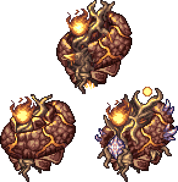
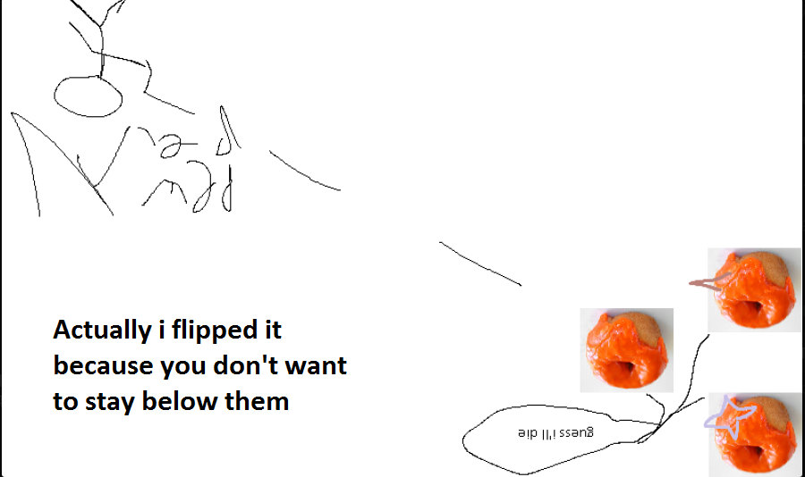

## Profaned Guardians

*"Guardians of the unholy flame…"*

* **Armor Sets:**

    * **Any class**: Lunar.

    * **Melee**: Ataxia.

    * **Throwing**: Xeroc.

* **Weapon Loadouts:**

    * **Ranged**: *Onyx Chain Blaster*, Holy Fire Bullets, Astreal Defeat, Shredder, Elemental Blaster. Terra Ammo.

    * **Melee**: *Galactus Blade*, Ark of the Elements, *Omega Biome Blade*.

    * **Mage**: Elemental Ray, Nuclear Fury, Nano Purge, Ultra Liquidator, Asteroid Staff

    * **Summoner**: Elemental Axe, Energy Staff, Stardust Dragon.

    * **Throwing**: Elemental Disk, Xeroc Pitchforks.

* **General Accessories:**

    * Seraph Tracers, Asgard's Valor, Absorber, The Community, Ambrosial Ampoule, Deific Amulet, Void of Extinction.

* **Class Specific Accessories:**

    * **Ranged**: Daedalus Emblem, Ranger Emblem.

    * **Melee**: Bloody Worm Scarf.

    * **Mage**: Sigil of Calamitas, Eldritch Soul Artifact.

    * **Summoner**: Statis' Blessing, Statis’ Curse.

    * **Throwing**: Statis' Ninja Belt.

* **Strategy:**

    * Keep your distance and don't let the main guardian fly over you, since being below it will make it dash down at you. Making a slope out of actuated hallow blocks will also help due to expanding the biome. Or just fight them in Hell, that works too.

<iframe width="620" height="315" src="https://www.youtube.com/embed/9TuWfjE9IU8" frameborder="0" allowfullscreen></iframe>

