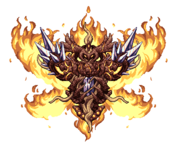

## Providence, the Profaned Goddess

*"The air is burning…"*

* **Armor Sets:**

    * **Any class**: Lunar

    * **Melee**: Ataxia.

    * **Throwing**: Xeroc.

* **Weapon Loadouts:**

    * **Ranged**: *Onyx Chain Blaster*, Clockwork Bow, Shredder, Elemental Blaster, Starfleet. Holy Fire Ammo.

    * **Melee**: *Omega Biome Blade*, Elemental Shiv, Ark of the Elements, *Galactus Blade*.

    * **Mage**: Elemental Ray, Nano Purge, *Genisis*, Last Prism.

    * **Summoner**: Elemental Axe, Energy Staff, Stardust Dragon.

    * **Throwing**: Elemental Disk, Xeroc Pitchforks.

* **General Accessories:**

    * Seraph Tracers, Asgard's Valor, The Community, Absorber, Ambrosial Ampoule, Deific Amulet, Void of Extinction.

* **Class Specific Accessories:**

    * **Ranged**: Daedalus Emblem.

    * **Melee**: Bloody Worm Scarf, Mechanical Glove.

    * **Mage**: Sigil of Calamitas, Eldritch Soul Artifact.

    * **Summoner**: Statis' Blessing, Statis’ Curse.

    * **Throwing**: Statis' Ninja Belt.

* **Strategy:**

    * Try to always run in a single direction. When she enters her shell, circle around her, then keep running when she exits. You also want to mostly fly because lava blobs stick to literally any tile. Use ML strats for laser attack.

    * Taking down the extra guardians, especially the healing one, should be your priority.

    <iframe width="620" height="315"
        src="https://www.youtube.com/embed/gVTo_it1O7A" frameborder="0" allowfullscreen>
    </iframe>

