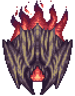
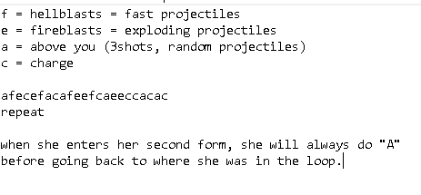
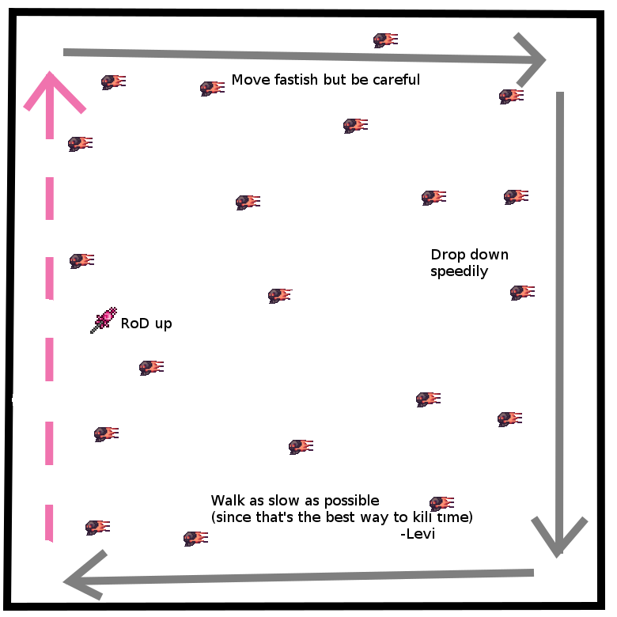
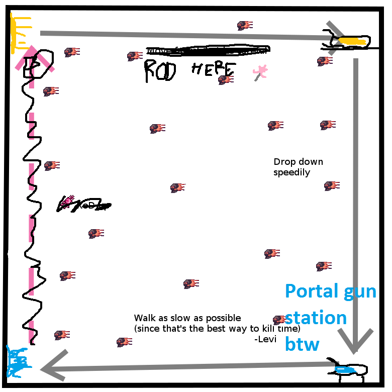

## Supreme Calamitas

*"Do you enjoy going through hell?"*

* **Armor Sets**:

    * **All classes**: Auric Tesla.

* **Weapon Loadouts:**

    * **Ranged**: Heavenly Gale, Chicken Cannon, Vanquisher Arrows.

    * **Melee**: Ark of the Cosmos, Scourge of the Cosmos, Burning Sky, Exoblade.

    * **Mage**: *Voltaic Climax*, Yharim's Crystal, Phoenix Flame Barrage.

    * **Summoner**: *Yharon's Kindle Staff*, *Cosmic Immaterializer*, Staff of the Mechworm.
    
    * **Throwing**: Celestus, *Scourge of the Cosmos*

* **General Accessories:**

    * Seraph Tracers+, Asgardian Aegis, Core of the Blood God, The Community, Affliction (?), Dark Sun Ring, Dimensional Soul Artifact.

* **Class Specific Accessories:**

    * **Ranged**: Elemental Quiver.

    * **Melee**: Elemental Gauntlet.

    * **Mage**: Ethereal Talisman, Eldritch Soul Artifact.
    
    * **Summoner**: Statis' Blessing, Statis’ Curse, Statis’ Belt of Curses, Godly Soul Artifact.
    
    * **Throwing**: Statis' Ninja Belt, Statis’ Belt of Curses, Nanotech.

    * **Special combination**: Mage armor, Statis' Blessing and Statis’ Curse (+3 minion slots each), Dark Sun Ring (+1 minion slot)/Eldritch Soul Artifact (+2 minion slots), Voltaic Climax, Cosmic Immaterializer.  
Having specifically those 3 accessories should bring you to 10 minion slots, allowing you to use Immaterializer while also using Voltaic as your main weapon.  
**Note:** This combination has been banned from Untouchable/Dead Inside challenges.

* **Weapon explanations:**

    * **Ranger**:

       * Heavenly Gale is pretty much the only ranged weapon at its tier that can do decent damage against SCal.

       * Chicken Cannon is specifically for killing the Soul Seeker ring as its explosions have massive range.

    * **Melee**:

       * Ark of the Cosmos will be your main damage dealer.

       * Scourge of the Cosmos (Melee) helps kill the Brimstone Hearts and makes the 1st Sepulcher phase go by very quickly. It should also always be used when SCal is invulnerable (except for the Soul Seeker phase and the final bullet hell). 

       * Burning Sky is specifically for killing the Soul Seeker ring. This weapon’s projectiles cover a large portion of the screen, and        as such it is very good for killing off the Soul Seeker ring that often goes offscreen.

       * Exoblade can be an alternative heart killer if you don't want to bother with Scourge.

    * **Mage**:

       * Voltaic Climax will be your main damage weapon. Used for pretty much almost everything in the fight.

       * Yharim's crystal has enough dps to be viable but is generally harder to use than Voltaic Climax.

       * Phoenix Flame Barrage, much like Burning Sky and Chicken Cannon, is specifically for the Soul Seeker ring due to its big AoE.
     
    

    * **Summoner**:
Optimal setups are the following:

       1. 1 Cosmic Immaterializer + 1 Yharon son, with the rest Mechworms.

       2. 1 Cosmic Immaterializer + 2 Yharon sons, with the rest Mechworms.

       3. 1 Cosmic Immaterializer + 1 Yharon son + Godly Soul Artifact, with the rest Mechworms.

       **Note:** Mechworms with less than 5 segments are worthless.

   * **Throwing**: 
  
       * Celestus will be your main damage weapon. You’ll have to use this for the Soul Seeker ring, sadly throwing doesn’t have any other options. Try to guess/watch where the Soul Seekers are, and aim as best as you can.

       * Scourge of the Cosmos (Throwing): like Melee, use this one during the first bullet hell, then switch to Celestus when Sepulcher spawns. The eaters from this weapon will help kill the Brimstone Hearts and make the 1st Sepulcher phase go by very quickly. Do this on every bullet hell.

    

* **Strategy:**

   * Supreme Calamitas DOES have a set pattern of attacks, she will do the same thing every time. The only variance is that when she says "Don't worry, I still have plenty of tricks left" she will always fly above you while firing attacks before falling back into place in her pattern loop. I will leave a picture for her pattern below this. Try to stay near the ceiling at all times during her bullet hell phases to make the exploding projectiles spawn outside of the arena and break against the arena walls. If you can surround your Scal arena in walls, they can explode farther out and give you bigger gaps to dodge through. 
   
        

   * In her mobile phase, where she doesn't stick to your sides and flies around, she will choose her attacks randomly. The safest thing to do here is to try and move from one side of the arena to the other in the shape of an “U”. Move decently quickly but pay attention; you don’t want to get sniped by any of her projectiles. In her 2nd phase, she charges at you about twice as often as the 1st phase, so always be on your guard, and be prepared to dodge her charges when she turns black.

### First Bullet Hell Phase

   * Use horizontal movement for the first 5 seconds, mostly vertical movement for the following 5 seconds, and slowly move horizontally to the left for the last 5 seconds.

   * If you're Melee or Throwing, use Scourge of the Cosmos to pile up the eaters during this phase. Then switch to your main weapon after this phase ends. This will speeds up the next phase considerably.	

   * This tactic also works with other classes, though a bit less effectively. If you’re Mage, use Voltaic Climax to create in advance during the last few seconds of this phase a couple orb rings in the spots where the Brimstone Hearts will spawn.
   
### First Sepulcher Phase
   * Focus on the brimstone hearts: the longer Sepulcher stays alive the more unnecessary hits you will take. 

   * When SCal positions herself on your sides move vertically to dodge her projectiles (if moving downwards you want to do “short hops” while flying so you properly go between shots). 

   * You should try to end this phase at the upper half of the arena.

### Second Bullet Hell Phase

   * Stay at the top right corner of the arena. The Gigablasts  will spawn from either the top or from the right side of the screen. 

   * Try to not stay too close to the walls, as you might get stuck in between all the brimstone blasts.

### Third Bullet Hell Phase

   * Stay in the upper half of the arena, both the Gigablasts  and Abyssal Fireblasts  spawn from only the top of the screen. 
   
   * Watch out for the Abyssal Souls rings  that may overlap each other.

### Brothers Phase

   * The brothers are not very dangerous, their only attack is firing a single brimstone blast down at you. Be careful when moving diagonally upwards as you can get sniped easily.

   * Dodge by moving mostly vertically.

   * Try to end this phase in the upper half of the arena.

### Fourth Bullet Hell Phase

   * This phase is basically the same as the 3rd bullet hell, but when you see a Brimstone Monster  spawn from the top of the screen slowly move downwards. As you progress in the fight more and more of them will appear, you can however stack them on top of each other effectively mitigating the extra numbers completely.

**Note:** From this phase onward you should always be circling around the arena.
Try to not turn around and circle the other way unless you get blocked by a Brimstone Monster or SCal and her projectiles.
   * It’s recommended to try to keep circling in a clockwise direction, as it will make the final bullet hell phase a bit easier to manage.

### Soul Seeker Phase
	

   * For this phase you will be switching to certain weapons mentioned above (except for Throwing) to clear out the soul seeker ring. 
   * Watch out for the Abyssal Souls  that the Soul Seekers fire, as they can snipe you from unexpected and awkward angles.

### Final Bullet Hell Phase

   * The picture below describes dodging in this phase in the simplest way possible. Memorize it. 
   
   
   
   * Or do this, because this is actually a legitimate strat.
   
   

**Note:** If you somehow end up going in a counter-clockwise circle this tactic will still work, but it will harder to manage because moving up in this bullet hell is very dangerous as the Brimstone Flame Skulls  will always spawn from the right side of the screen.

Moving counter-clockwise means you’ll be flying up at the right side, which means you’ll be both at risk of getting sniped by projectiles from above while simultaneously being dangerously close to the Brimstone Flame Skulls'  spawn point. 

### Second Sepulcher Phase
   **Note:** Keep circling.
   * For this phase you can try to circle slower than usual, giving you more time to attack the brimstone hearts; This is risky so be careful when attempting to do so.

      * Summoners don’t have to use this tactic as their minions will attack the hearts independently.

   * If you're unlucky, Sepulcher can spawn in particularly bad spots, possibly getting cheap shots on you with its Abyssal Souls  . Sadly, not much can be done about it other than trying your best to dodge it as well as everything else SCal is throwing at you.

### Dying Phase

   * During this phase, SCal will be monologuing while staying in place, not attacking. 
The only threats in this phase are the Brimstone Monsters
  (which gain a speed boost during this phase) and any leftover projectiles prior to this phase; however, none of the threats here are actually dangerous at all (aside from Brimstone Monsters, but if you have stacked them they’re completely harmless since you can go in a circle).
 
   * Simply circle around the arena while waiting for SCal to finish her monologue. When she finishes, she’ll be vulnerable again. Attack her until her HP reaches zero.
   

<iframe width="620" height="315" src="https://www.youtube.com/embed/B8WdcXRWf_c" frameborder="0" allowfullscreen></iframe>

