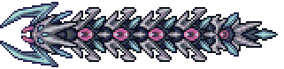
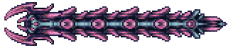

## Storm Weaver

*"The Devourer took pity on its fellow kind…"*

* **Armor Sets**:

    * **Any class**: Tarragon.

    * **Melee**: Ataxia.

* **Weapon Loadouts:**

    * **Ranged**: *Onyx Chain Blaster*, Holy Fire Bullets, Blissful Bombardier, Shredder, Telluric Glare. Holy Fire Ammo.

    * **Melee**: Stellar Striker, Holy Collider, Ark of the Elements, Galactus Blade.

    * **Mage**: *Elemental Ray*, Nuclear Fury, Purge Guzzler.

    * **Summoner**: Elemental Axe, Energy Staff, Stardust Dragon.

    * **Throwing**: Elemental Disk, Molten Amputator.

* **General Accessories:**

    * Seraph Tracers, Asgard's Valor/Elysian Aegis, Bloodflare Core, The Community, Absorber, Ambrosial Ampoule, Void of Extinction.

* **Class Specific Accessories:**

    * **Ranged**: Daedalus Emblem, Ranger Emblem.

    * **Melee**: Yharim's Insignia, Bloody Worm Scarf.

    * **Mage**: Sigil of Calamitas, Eldritch Soul Artifact.

    * **Summoner**: Statis' Blessing, Statis’ Curse.

    * **Throwing**: Statis' Ninja Belt.

* **Strategy:**

    * On Rev or below, just stay grounded and run away while aiming at its tail. On Death do the same thing for phase 1, but in phase 2 try to loop around the worm whenever it gets close, and then run away while shooting it from a distance. In reality it's a big fat crawltipede.

<iframe width="620" height="315" src="https://www.youtube.com/embed/17p6Ol_ugRk" frameborder="0" allowfullscreen></iframe>

