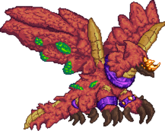

## Jungle Dragon, Yharon

*"It yearns for the jungle…"*

* **Armor Sets:**

    * **Any class**: Tarragon, Bloodflare, God Slayer. Preferrably God Slayer.

* **Weapon Loadouts:**

    * **Ranged**: *Phangasm*, Alluvion, Minigun. *Vanquisher Arrows*.

    * **Melee**: *Galaxia*, Devil's Devastation.

    * **Mage**: *Magnetic Meltdown*, *Alpha Ray*, Venusian Trident.

    * **Summoner**: Staff of the Mechworm, Calamari's Lament, Ethereal Subjugator.

    * **Throwing**: Executioner's Blade.

* **General Accessories:**

    * Seraph Tracers+, Asgardian Aegis, Core of the Blood God, The Community, Reaper Tooth Necklace, The Sponge, Rampart of Deities, Dimensional Soul Artifact.

* **Class Specific Accessories:**

    * **Ranged**: Elemental Quiver.

    * **Melee**: Elemental Gauntlet.

    * **Mage**: Ethereal Talisman, Eldritch Soul Artifact.

    * **Summoner**: Statis' Blessing, Statis’ Curse, Statis’ Belt of Curses.

    * **Throwing**: Statis' Ninja Belt, Statis’ Belt of Curses, Nanotech.

* **Strategy:**

    * Build your arena on surface, going to space/underground enrages him. The better you get at knowing what he does in each phase, the more likely you are to survive. The general movement pattern consists of a large oval, try to put a platform kinda high up in your arena for refreshing your flight time. Try to spawn his infernadoes in opposite corners of the arena, something like top right, then bottom left. Don't be afraid of his true second phase, it’s not there yet. Also move in an oval shape to try and space out the infernadoes.

## Jungle Dragon, Yharon (Rematch)

*"The dark sun awaits."*

* **Armor Sets**:

    * **Any class**: Silva.

* **Weapon Loadouts:**

    * **Ranged**: *Phangasm*, Alluvion. *Vanquisher Arrows*.

    * **Melee**: Empyrean Knives, Scourge of the Cosmos*, *Greatsword of Blah*.

    * **Mage**: *Voltaic Climax*, *Alpha Ray*, Venusian Trident.

    * **Summoner**: Staff of the Mechworm, Calamari's Lament, Ethereal Subjugator.

    * **Throwing**: Executioner's Blade, *Scourge of the Cosmos*, Empyrean Knives.

* **General Accessories:**

    * Seraph Tracers+, Asgardian Aegis, Core of the Blood God, The Community, Reaper Tooth Necklace, The Sponge, Rampart of Deities, Dark Sun Ring, Dimensional Soul Artifact.

* **Class Specific Accessories:**

    * **Ranged**: Elemental Quiver.

    * **Melee**: Elemental Gauntlet.

    * **Mage**: Ethereal Talisman, Eldritch Soul Artifact.

    * **Summoner**: Statis' Blessing, Statis’ Curse, Statis’ Belt of Curses.

    * **Throwing**: Statis' Ninja Belt, Statis’ Belt of Curses, Nanotech.

* **Strategies:**

    * Strats mostly don't change up until his final phase where he will become invulnerable for some time (use RoD for dodging everything he throws at you). Upon transition he will heal up and you just do what you did before - shoot at it until it dies. When below 66% HP Yharon will start spawning flarenadoes again, and when at very low HP he will begin charging at you constantly. On Death this phase goes fucking ballistic so always keep an eye out for projectiles while doing your ovals. And don’t forget about your minimap.

<iframe width="620" height="315" src="https://www.youtube.com/embed/Nb59Dri37tk" frameborder="0" allowfullscreen></iframe>

