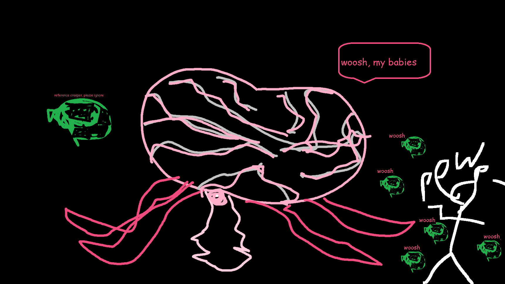

## Brain of Cthulhu

"A horrible chill goes down your spine..."

* **Armor Sets:**

    * **Any class**: Victide.

    * **Mage**: Jungle, Meteor, Wizard Hat+Diamond Robe+Meteor Leggings/Jungle Pants.

    * **Throwing**: Ninja, Fossil.

* **Weapon Loadouts:**

    * **Ranged**: Seabow, *Opal Striker*, Pumpler/Minishark, *Firestorm Cannon*. Any Ammo.

    * **Melee**: Seashell Boomerang, Rotted Fork.

    * **Mage**: Frost/Water Bolt, Mana Rose, Gem Staves, *Storm Spray*, Space Gun.

    * **Summoner**: Seabound Staff.

    * **Throwing**: *Scourge of the Desert*, Crystalline, Spiky Balls, Mycoroot, Urchin Stinger.

* **General Accessories:**

    * Hermes Boots+, Counter Scarf/Shield of Cthulhu, X In a Bottle, Shiny Red Balloon+, Flying Carpet, Crimson Flask, Laudanum, Stress Pills.

* **Class Specific Accessories:**

    * **Mage**: Celestial Cuffs, Mana Flower (optional)

    * **Summoner**: Papyrus Scarab, Spirit Generator, Fungal Clump.

    * **Melee**: Cross Necklace+.

    * **Throwing**: Raider's Talisman.

* **Weapon explanations:**

    * **Any class**: anything that pierces is good, you don't want creepers to stay around.

* **Strategy:**

    * As with Eater of Worlds, having a big open space will help you immensely due to the fact that creepers like to hide in the walls. He's less resistant to piercing damage unlike his Corruption counterpart, so those weapons are going to be kings in first phase. General course of action you should take is staying *just* out of his reach, so you don't get "accidently" nuked by his warps. Additionally, if you're in Revengeance/Death you want to save your Rage/Adrenaline until most creepers are dead, since he is going to be respawning them constantly, and you might be locked in a never-ending loop of you killing one creeper and another one taking its place.

<iframe width="620" height="315" src="https://www.youtube.com/embed/tllBlQ4KUZ8" frameborder="0" allowfullscreen></iframe>

