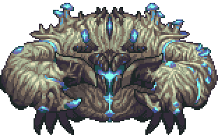
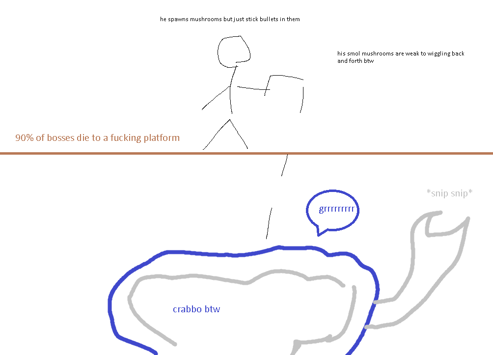
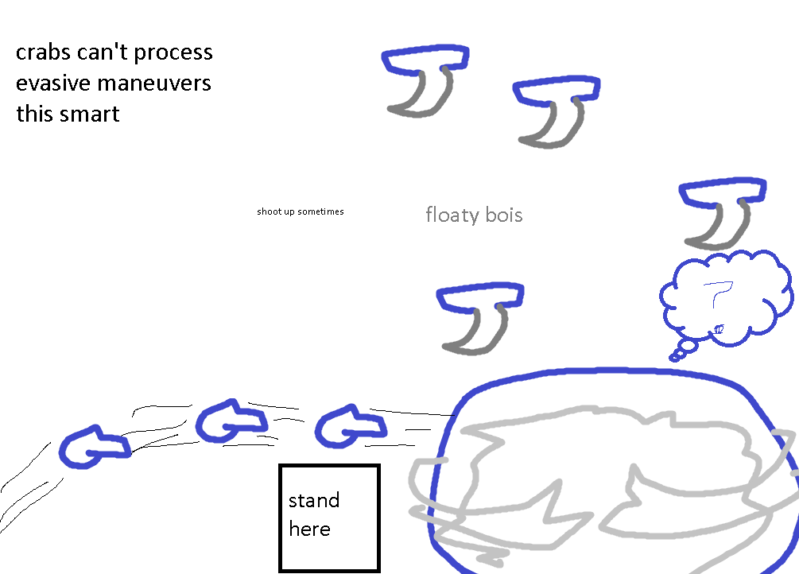

## Crabulon

*"The Perfect One..."*

* **Armor Sets:**

    * **Any class**: Wulfrum, Victide.

    * **Mage**: Jungle, Meteor, Wizard Hat+Diamond Robe+Meteor Leggings/Jungle Pants.

    * **Throwing**: Ninja, Fossil.

* **Weapon Loadouts:**

    * **Ranged**: Barinade, Opal Striker, Any Ammo.

    * **Melee**: Seashell Boomerang, Bladecrest Oathsword.

    * **Mage**:Frost/Water Bolt, Mana Rose, Space Gun, Magna Cannon.

    * **Summoner**: Slime Staff, Seabound Staff, Sun Spirit Staff.

    * **Throwing**: Seashell Boomerang, Grenades, Spiky Balls, Urchin Stinger.

* **General Accessories:**

    * Hermes Boots+, X In a Bottle, Flying Carpet, Shiny Red Balloon, Laudanum, Stress Pills, Counter Scarf/Shield of Cthulhu, Sun Stone.

* **Class Specific Accessories:**

    * **Mage**: Celestial Cuffs, Mana Flower (optional).

    * **Summoner**: Papyrus Scarab, Spirit Generator.

    * **Melee**: Cross Necklace+.

    * **Throwing**: Raider's Talisman.

* **Weapon explanations (if required)**:

    * **Ranged**: Both of those have good DPS.

    * **Melee**: Ranged attacks are good, Seashell Boomerang practically lasts through the entire PHM.

    * **Mage**: Crabbo doesn't move quite often, so anything that can hit him multiple times naturally would be good.

    * **Summoner**: Those are your only 3 options as of now.

    * **Throwing**: Avoid grenades if you're gonna stand next to him, spiky balls are good since he doesn't move too often and you can keep him in one area.

* **Strategies:**

   * **General tips**: Fight him in a flat and open area, and make sure you have room to jump above him. Either dash below him when he jumps or jump over him throughout the fight to move away from the flying mushroom projectiles. Be careful, he shoots mushrooms occasionally in an attempt to cut you off, either stay close enough to him where they don't effect you or keep your distance.

   * **Strategy 1 - Overground mushroom biome and hold A/D**: Do exactly that, keep him at the very edge of your screen and he won't be able to do much if you just walk away from him. No, he doesn't enrage out of his biome, you merely need it to summon him.

   * __Strategy 2 - "Crabs can't process such advanced avoidance maneuvers"__: Stand right next to him and all attacks, but one will miss you (which is the vertical spam). If he tries to land on you - dash in his direction and stand on the other side, occasionally shooting upwards to get rid of flying minions. Naturally this strat discourages using any weapons that might indirectly hurt you (such as Grenades) since you're going to be hugging the poor Crabbo all the time.
      * Quickly spamming your A and D keys will confuse Crabulon and cause him to stay still (he can still move during his jumps though). This can be abused by true melee weapons (see the 2nd video). 

<iframe width="620" height="315" src="https://www.youtube.com/embed/tO3vwPg3OPE" frameborder="0" allowfullscreen></iframe>

<iframe width="620" height="315" src="https://www.youtube.com/embed/jCU0BEIpKrc" frameborder="0" allowfullscreen></iframe>

