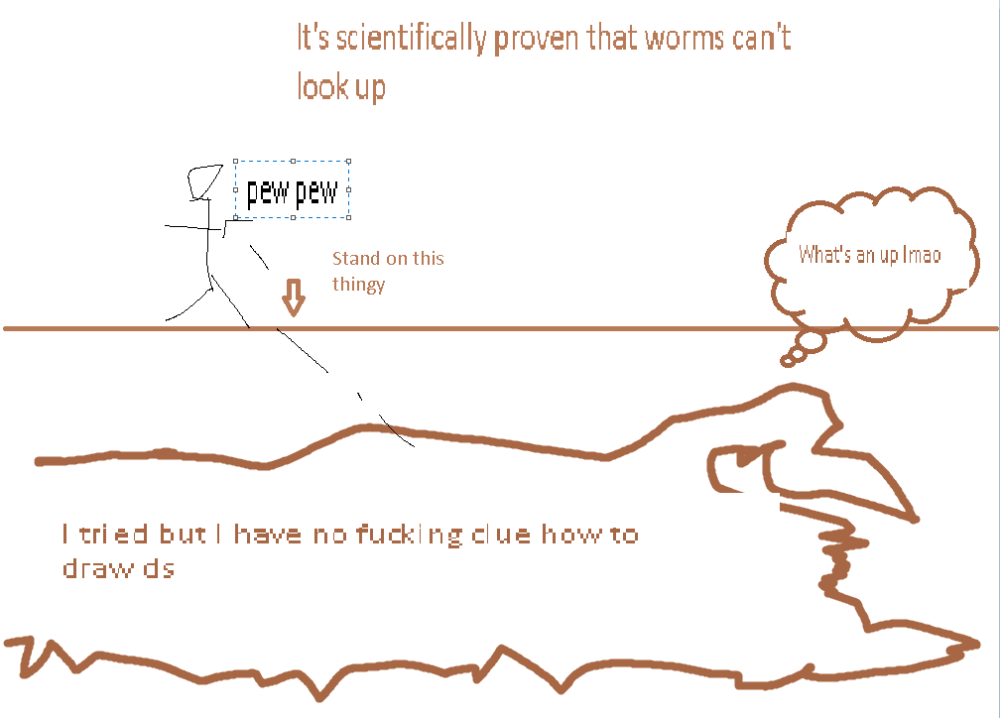

## Desert Scourge

*"The desert sand stirs..."*

* **Armor sets:**

    * **Any class**: Wulfrum, Victide.

    * **Mage**: Jungle, Meteor, Wizard Hat+Diamond Robe+Meteor Leggings/Jungle Pants.

    * **Throwing**: Ninja, Fossil.

* **Weapon Loadouts:**

    * **Ranged**: Wulfrum Bow, Seabow, Firestorm Cannon, Jester Arrows.

    * **Melee**: Seashell Boomerang, Mandible Claws, Bladecrest Oathsword, Starfury, Ball O' Hurt.

    * **Mage**: Water/Frost Bolt, Space Gun, Mana Rose, Coral Sprout, Vilethorn.

    * **Summoner**: Slime Staff.

    * **Throwing**: Crystalline, Seashell Boomerang, Spiky Balls, Urchin Stinger, Grenades.

* **General Accessories: **

    * Hermes Boots+, X In a Bottle, Magic Carpet, Grappling Hook, Amidias' Spark, Laudanum, Stress Pills, Shiny Red Balloon+, Sun Stone.

* **Class Specific Accessories:**

    * **Mage**: Magic Cuffs, Mana Flower (optional).

    * **Summoner**: Papyrus Scarab, Spirit Generator.

    * **Melee**: Cross Necklace/Star Veil.

    * **Throwing**: Raider's Talisman.

* **Weapon explanations (if required)**:

   * **Ranger**: All of those weapons are piercing, which is what you want to deal with DS since he's a worm.

   * **Melee**: Boomerang, Starfury and Claws are there for the same reason (and claws do share the same drawback of being non-viable in Death - DS deals ~360 damage with his head).

   * **Mage**: All of those should be self-explanatory (actually not smh).
If using Coral Sprout shoot ahead of him since the projectiles actually bounce before resting on the ground.

   * **Summoner**: Slimes can eat him within mere seconds.
    
   * **Throwing**: Grenades are the best weapon on the list, followed up by Spiky Balls (which require you to have boss walking over them), rest of them are pretty consistent in damage.

* **Strategies:**

   * **General tips**: Watch the minimap carefully, be prepared to move before he breaches the surface. On Rev+ difficulties he spawns two additional mini scourges, deal with them first. 

   * **Strategy 1 - Platform layer above the desert**: Self-explanatory, you make one or two layers of platforms ~20 tiles above the desert's surface and abuse Worm AI that can't go through air. Second layer of platforms helps with dodging smaller worms, if they ever manage to reach you. If for some reason DS refuses to stay underneath - drop down, wait for him to come at you and then quickly hook back up.

<iframe width="620" height="315" src="https://www.youtube.com/embed/qKwVbObLr-s" frameborder="0" allowfullscreen></iframe>

