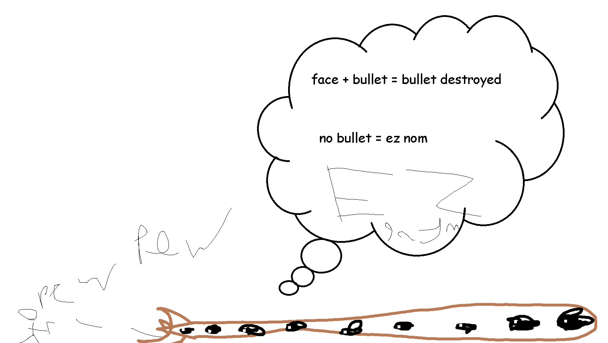

## Eater of Worlds

*"Screams echo around you..."*

* **Armor Sets:**

    * **Any class**: Victide.

    * **Mage**: Jungle, Meteor, Wizard Hat+Diamond Robe+Meteor Leggings/Jungle Pants.

    * **Throwing**: Ninja, Fossil.

* **Weapon Loadouts:**

    * **Ranged**: Opal Striker, Pumpler, Minishark, Firestorm Cannon, Seabow, Jester Arrows, Any Bullets.

    * **Melee**: Seashell Boomerang, Ball'o'Hurt, Mycelial Claws.

    * **Mage**: Water/Frost Bolt, Gem Staves, Space Gun, Coral Sprout.

    * **Summoner**: Seabound Staff, Slime Staff.

    * **Throwing**: Seashell Boomerang, Crystalline, Scourge of the Desert, Mycoroot, Molotovs, Urchin Stinger.

* **General Accessories:**

    * Hermes Boots+, Counter Scarf/Shield of Cthulhu, X in a bottle, Shiny Red Balloon+, Flying Carpet, Corrupt Flask, Laudanum, Stress Pills.

* **Class Specific Accessories:**

    * **Ranged**: Shark Tooth Necklace.

    * **Mage**: Celestial Cuffs, Mana Flower (optional).

    * **Summoner**: Papyrus Scarab, Spirit Generator, Fungal Clump.

    * **Melee**: Cross Necklace+.

    * **Throwing**: Raider's Talisman.

* **Weapon explanations (if required):**

    * **Ranged**: Firestorm Cannon pierces, Opal Striker just deals a lot of damage for 1 bullet cost, Minishark is better than Pumpler if you use Shark Tooth Necklace.

    * **Melee**: Boomerang pierces, Ball'o'Hurt also can pierce in some cases, Claws are just claws.

    * **Mage**: Piercing? Piercing.

    * **Summoner**: Sun Spirits aren't here because crits aren't worth the lack of constant piercing damage.

    * **Throwing**: Same as everything else, you want as much piercing as you can get.

* **Strategy:**

    * Do not even think about fighting him in a chasm, this is an extremely dumb idea that leads to you being overrun rather quickly. Prioritize hitting his head (unless in Death, since it will reflect projectiles) and try to avoid splitting him due to cursed flames balls. As usual, your arena consists of 3-5 platform layers over Corruption. Having more layers will give you the liberty of having much more space to dodge vile spits coming out of body segments, and will also allow you to hook up to dodge his ram. Having any piercing weapon would also help, but he resists them on higher difficulties, just as he resists explosive damage (although block Explosives can still rip him in half).

<iframe width="620" height="315" src="https://www.youtube.com/embed/EBmLgC1l4KU" frameborder="0" allowfullscreen></iframe>

