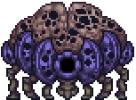

## Hive Mind

*"Rotten cysts are oozing from this corrupt land..."*

* **Armor Sets:**

    * **Any class**: Victide.

    * **Mage**: Jungle, Meteor, Wizard Hat+Diamond Robe+Meteor Leggings/Jungle Pants.

    * **Throwing**: Fossil.

* **Weapon Loadouts:**

    * **Ranged**: Pumpler, Minishark, *Opal Striker*. Silver/Meteor Bullets.

    * **Melee**: Seashell Boomerang, Meteor Fist.

    * **Mage**: *Water/Frost/Flare Bolt*, Demon Scythe, Magna Cannon.

    * **Summoner**: Seabound Staff, Hornet Staff, Imp Staff.

    * **Throwing**: Spiky Balls (phase 1 only), Crystalline, Seashell Boomerang, Scourge of the Desert (phase 1 only), Beenades.

* **General Accessories:**

    * Hermes Boots+, Shiny Red Balloon+, Band of Regeneration+, Counter Scarf/Shield of Cthulhu.

* **Class Specific Accessories**:

    * **Mage**: Celestial Cuffs, Mana Flower (optional)

    * **Summoner**: Papyrus Scarab, Spirit Generator, Fungal Clump.

    * **Melee**: Cross Necklace+.

    * **Throwing**: Raider's Talisman.

* **Strategy:**

    * Make the usual platform arena above your corruption and wait for a cyst to spawn. First phase is basically free, he just sits there doing nothing, focus the dank creepers when they spawn. In second phase, if he appears below you he swoops in the direction you were moving when he went invisible. If he circles you, wait until you know where he's gonna charge before you try and dodge it by hooking to another place. If he spawns above you then either dash away from him or drop below a platform and dash under to avoid the rain. While you’re dodging don’t neglect killing additional summons that are going to appear and attempt to ruin your day.

<iframe width="620" height="315" src="https://www.youtube.com/embed/1Ha2XxQg7xM" frameborder="0" allowfullscreen></iframe>

