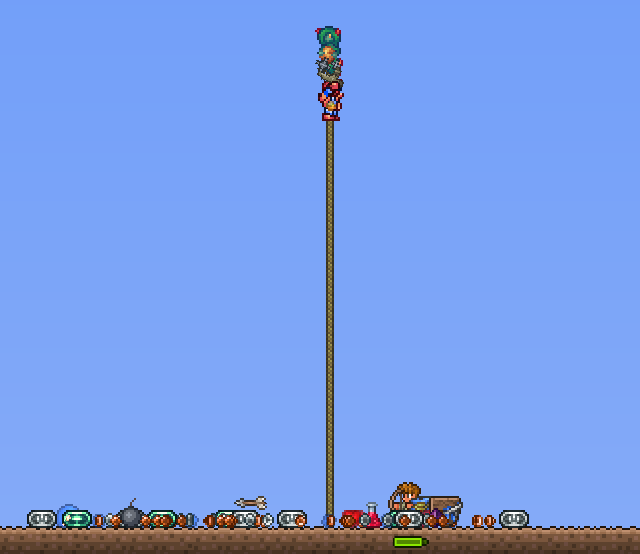
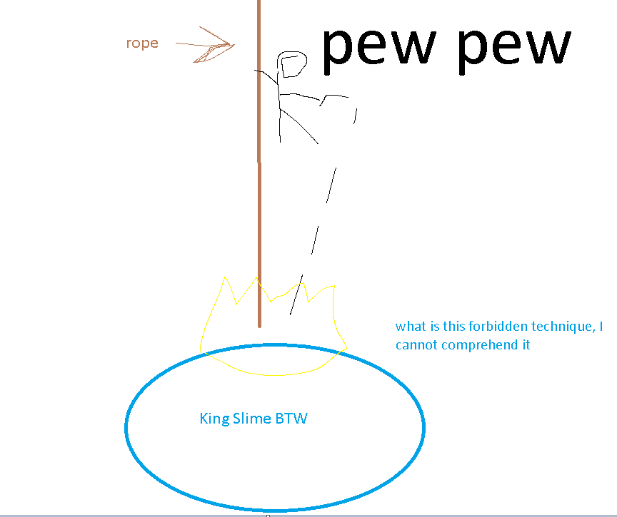

## King Slime

*"The lord of all things slimy."*

* **Armor sets:**

    * **Any class**: Wulfrum, Victide.

    * **Mage**: Jungle, Meteor, Wizard Hat+Diamond Robe+Meteor Leggings/Jungle Pants.

    * **Throwing**: Fossil.

* **Weapon Loadouts:**

    * **Ranged**: Wulfrum Bow, *Seabow*, Firestorm Cannon, Jester/Frostburn Arrows.

    * **Melee**: Seashell Boomerang, Mandible Claws, Starfury.

    * **Mage**: Plasma Rod, Wulfrum Staff, Water/Frost Bolt, Space Gun, *Mana Rose*.

    * **Summoner**: *Slime Staff*, Sun Spirit Staff.

    * **Throwing**: Crystalline, Seashell Boomerang, *Grenades*, Spiky Balls, Urchin Stinger.

* **General Accessories:**

    * Hermes Boots+, Magic Carpet, X In a Bottle, Shiny Red Balloon+, Band of Regeneration, Sun Stone.

* **Class Specific Accessories:**

    * **Mage**: Magic Cuffs, Mana Flower (optional)

    * **Summoner**: Papyrus Scarab, Spirit Generator.

    * **Melee**: Cross Necklace+, Amidias' Spark.

    * **Throwing**: Raider's Talisman.

* **Weapon explanations (if required):

    * **Ranged**: All of those weapons are piercing, which is what you want to deal with smaller slimes.

    * **Melee**: Boomerang and Starfury are quite easy to get, both are ranged, solid choice for keeping your distance. Mandible Claws are much trickier due to them being claw weapons, so you want Cross Necklace and Amidias Spark (since naturally you're going to be tanking damage). Warning: claws aren’t so viable in Revengeance, and are absolutely non-viable in Death.

    * **Summoner**: Slimes have great damage, they are possibly your best summon in early game until EoC; Sun Spirits are okay-ish, so you should stick with slimes for the most parts.

    * **Throwing**: Grenades are the best weapon on the list, followed up by Spiky Balls (which require you to have boss walking over them), rest of them are pretty consistent in damage.

* **Strategies:**

   * **Strategy 1 - Cheesing/Luigi%:**

What you wanna do here is sit on top of this rope (approximately 20-25 tiles high) and just shoot at him until he dies. Summoners don't even do anything other than sitting at the top. Obviously doesn’t work if you have no ranged attacks because you won’t be able to deal damage.

   * **Strategy 2 - Running away on platforms:**

King Slime has a memorable pattern of doing small jumps and then a big jump after, so that can be abused by making a platform high enough (biggest jump is 17 tiles) that he doesn't reach you. Naturally you still want ranged weapons.

<iframe width="620" height="315" src="https://www.youtube.com/embed/rxJCyBr4qvs" frameborder="0" allowfullscreen></iframe>

