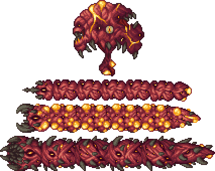
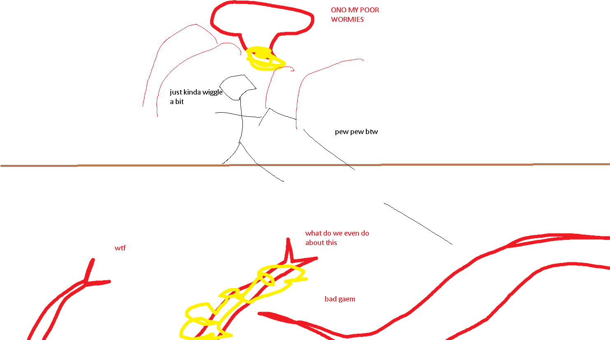

## The Perforators

*"Bloody cysts are erupting from the crimson's flesh…"*

* **Armor Sets:**

    * **Any class**: Victide.

    * **Mage**: Jungle, Meteor, Wizard Hat+Diamond Robe+Meteor Leggings/Jungle Pants.

    * **Throwing**: Fossil.

* **Weapon Loadouts:**

    * **Ranger**: *Firestorm Cannon*, *Pumpler/Minishark*, Opal Striker. Silver/Meteor Bullets.

    * **Melee**: *Seashell Boomerang*, Bladecrest Oathsword, Meteor Fist.

    * **Mage**: *Storm Spray, Water/Frost/Flare Bolt, Mana Rose*.

    * **Summoner**: Seabound Staff, Hornet Staff, Imp Staff.

    * **Throwing**: *Scourge of the Desert*, Crystalline, Beenades, Molotovs.

* **Weapon explanations:**

    * **All classes**: since this is pretty much EoW that splits into 3 different worms instead of 234512 then whatever would’ve been good on him remains good on them => any piercing is good.

* **General Accessories:**

    * Hermes Boots+, Shiny Red Balloon+, Flying Carpet, any Hook, Counter Scarf, Laudanum/Stress Pills.

* **Class Specific Accessories:**

    * **Mage**: Celestial Cuffs, Mana Flower (optional).

    * **Summoner**: Papyrus Scarab, Spirit Generator, Fungal Clump.

    * **Melee**: Cross Necklace/Star Veil.

    * **Throwing**: Raider's Talisman.

* **Strategy:**

    * Do the usual multi-platform arena setup (2-3 platforms 15-20 blocks above each other). Hive's blood splurts can be easily dodged by moving like a pendulum - left and right (besides there are a lot of openings in there). Attack hive until you get one worm to spawn, kill the worm, repeat the process until all 3 worms are dead.

