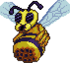

##  Queen Bee

*"The matriarch of jungle hives…"

* **Armor Sets:**

    * **Any class**: Victide.

    * **Mage**: Jungle, Meteor, Wizard Hat+Diamond Robe+Meteor Leggings/Jungle Pants.

    * **Throwing**: Fossil.

* **Weapon Loadouts:**

    * **Ranger**: Pumpler/Minishark. *Opal Striker*. Superball bullets/Meteor Bullets.

    * **Melee**: Seashell Boomerang

    * **Mage**: Water/Frost/Flare Bolt, Mana Rose.

    * **Summoner**: Seabound Staff, Imp Staff.

    * **Throwing**: Crystalline, Seashell Boomerang, Scourge of the Desert.

* **General Accessories:**

    * Hermes Boots+, Shiny Red Balloon+, Flying Carpet, X In a Bottle, Bezoar, Crown Jewel, Counter Scarf, Laudanum/Stress Pills.

* **Class Specific Accessories:**

    * **Mage**: Celestial Cuffs, Mana Flower (optional).

    * **Summoner**: Papyrus Scarab, Spirit Generator, Fungal Clump.

    * **Melee**: Cross Necklace/Star Veil, Feral Claws.

    * **Throwing**: Raider's Talisman.

* **Strategies:**

    * **Strategy 1 - I like cramped spaces**: dig out most of the hive, place platforms. There's nothing really special about this boss, other than it sometimes being laggy as hell, you just jump over/hook under her dashes; slowly walk to the side as she does her machinegun attack; use piercing weapons whenever she summons bees.

    * **Strategy 2 - I don't like cramped spaces and I don’t want to be in the jungle anymore**: the entirety of the above, except the only difference is you tossing a sticky bomb under blocks that have larva sitting on them, warping out to home, proceeding with the fight as usual, but in your normal arena.

    * **Strategy 3 - Big brain**: all you do is keep running to the side, occasionally jumping up if she's dashing at you. The only thing you’ll need is a sizeable platform to which you can lure her.
