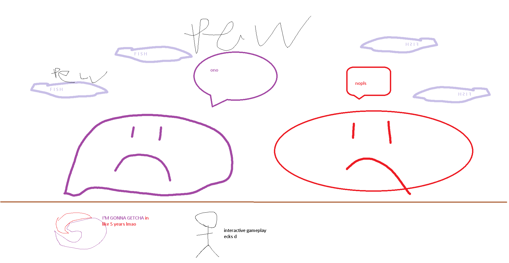
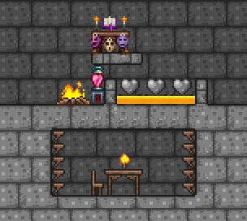

## The Slime God

*"Blighted sludge spreads throughout the world's evil…"*

* **Armor Sets:**

    * **Any class**: Aerospec.

    * **Mage**: Jungle, Meteor, Wizard Hat+Diamond Robe+Meteor Leggings/Jungle Pants.

    * **Throwing**: Fossil.

* **Weapon Loadouts:**

    * **Ranged**: *Archerfish*. Any Ammo, but preferably the one that has highest damage.

    * **Melee**: Bladecrest Oathsword, Ball o' Fugu, Aorta.

    * **Mage**: *Black Anurian*, Demon Scythe.

    * **Summoner**: Herring Staff.

    * **Throwing**: *Lionfish*, Beenades, Rot/Tooth Ball, Molotov Cocktails (for minions).

* **Weapon explanations:**

    * **Any class**: Abyss weapons. Best weapons at the time.

* **General Accessories:**

    * Frostspark Boots, Frog Leg, Shiny Red Balloon+, Flying Carpet, Siren's Heart, Counter Scarf/Shield of Cthulhu, Laudanum, Stress Pills, Skyline Wings.

* **Class Specific Accessories:**

    * **Mage**: Celestial Cuffs, Mana Flower (optional).

    * **Summoner**: Papyrus Scarab, Spirit Generator, Fungal Clump.

    * **Melee**: Cross Necklace+, Bloody Worm Tooth.

    * **Throwing**: Raider's Talisman.

* **Special (Facetanking in Revengeance)**: Molten Armor, Crown Jewel, Laudanum, Stress Pills, Star Veil, Flesh Knuckles, Siren's heart, Standing in honey (hooked down to the floor), 3 Heart Statues, Dryad's Blessing (Buff), Well Fed (Buff), Bewitching/Summoning (Buff), Regeneration (Buff), Iron Skin (Buff), everything on Warding.

* **Strategies:**

   * **Strategy 1**: 5 platform layers (you can get away with 3), each ~15 tiles away from each other, summon the boss and trap the big slimes on the top layer, they will only jump around and spit mines at you, while Core tries to smack you like a pendulum. Focus on Crimulan God since his buffs are much more mediocre than Ebonian or Core's. After Crimulan is dead prioritize getting both Ebonian and Core to the lowest health possible and then pop both of them. Reason to this order is that Ebonian constantly spawns flying slimes after being damaged, which can reach you on lower platforms, and you certainly don’t want to divert any attention to them. Killing the Core first might be tempting, but by doing so you’re just going to launch remaining gods into pre-nerf state where they act like biome mimics.

   * **Strategy 2 - Luigi%**: build this, get into honey, hook yourself to the floor so you don't get warped off the ground, kill the boss (you might fail since this is an old and unstable strat).
 

<iframe width="620" height="315" src="https://www.youtube.com/embed/KwXsfvW29eU" frameborder="0" allowfullscreen></iframe>

