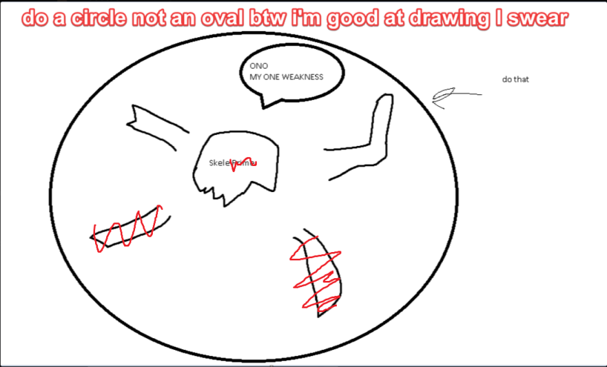

## Skeletron

*"The cursed guardian of the dungeon…"*

* **Armor Sets:**

    * **Any class**: Aerospec.

    * **Mage**: Jungle, Meteor, Wizard Hat+Diamond Robe+Meteor Leggings/Jungle Pants.

    * **Throwing**: Fossil.

* **Weapon Loadouts:**

    * **Ranged**: Pumpler, Minishark, Firestorm Cannon, Opal Striker, Silver/Meteor Bullets.

    * **Melee**: *Seashell Boomerang*, Meteor Fist, Bladecrest Oathsword, Perfect Dark, Aorta.

    * **Mage**: Water/Flare/Frost Bolt, Shadowdrop Staff/Blood Bath, Demon Scythe, Space Gun.

    * **Summoner**: Blood Clot Staff/Dank Staff, Hornet/Imp Staff.

    * **Throwing**: Beenades, Scourge of the Desert, Rot/Tooth Ball.

* **General Accessories:**

    * Lightning Boots+, Shiny Red Balloon+, X in a Bottle+, Counter Scarf/Shield of Cthulhu, Laudanum, Stress Pills.

* **Class Specific Accessories:**

    * **Mage**: Celestial Cuffs, Mana Flower (optional)

    * **Summoner**: Papyrus Scarab, Spirit Generator, Fungal Clump.

    * **Melee**: Cross Necklace+.

    * **Throwing**: Raider's Talisman.

* **Weapon explanations:**

    * **Any class**: St this point you should start thinking why piercing damage with high attacking speed is bad, so anything that pierces starts falling off in effectiveness.

    * **Mage**: Bolts pierce and you can surround your arena with walls so they keep bouncing, rain staves are an extremely good choice since you will only need to circle and point at the boss, Scythe's the same as bolts except it doesn’t bounce.

    * **Summoner**: Clots are somewhat bad because of the fact that they pierce, but you don't have that many choices.

    * **Throwing**: All of those are spammable, have good hitboxes, deal good damage, solid choices.

* **Strategy:**

    * Use the usual arena, (3-4 platforms, 15-20 blocks above each other), upon summoning quickly run/hook to the platforms and start dashing around, generally going in a clockwise/counter-clockwise pattern. Focus hands first because you don't want to get chain-juggled between them and his head.

<iframe width="620" height="315" src="https://www.youtube.com/embed/IrEGgOMWcGw" frameborder="0" allowfullscreen></iframe>

