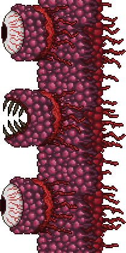
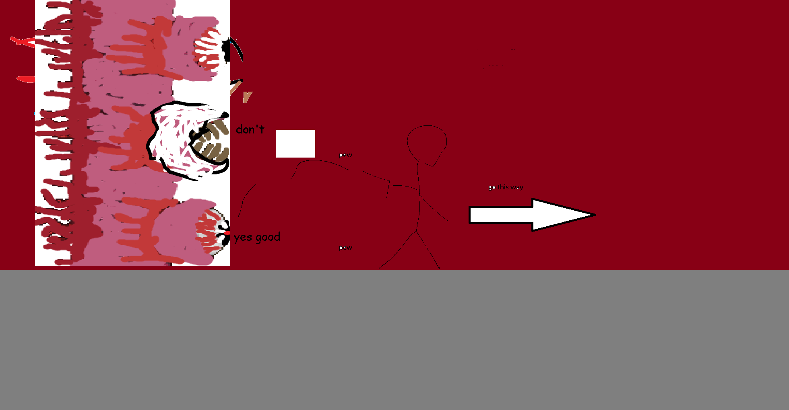

## Wall of Flesh

*"The master and core of the world…"*

* **Armor Sets:**

    * **Any class**: Aerospec, Statigel.

    * **Mage**: Jungle, Meteor, Wizard Hat+Diamond Robe+Meteor Leggings/Jungle Pants.

    * **Throwing**: Fossil.

* **Weapon Loadouts:**

    * **Ranged**: *Archerfish, Overloaded Blaster*. Any Ammo, preferably highest damage bullet though.

    * **Melee**: Gelitic Blade, Bladecrest Oathsword, Ball O' Fugu, Night’s Stabber, Bloody Edge.

    * **Mage**: *Black Anurian*, Water/Flare Bolt, Demon Scythe, Night's/Carnage Ray.

    * **Summoner**: Herring Staff.

    * **Throwing**: *Beenades*, Lionfish, Gel Dart.

* **General Accessories:**

    * Frostspark Boots, Lava Waders (or Obsidian Skin + Water Walking potions), Counter Scarf/Shield of Cthulhu, Laudanum, Stress Pills, Hive Pack (if using Beenades) Skyline Wings, Siren's Heart.

* **Class Specific Accessories:**

    * **Melee**: Bloody Worm Tooth, Cross Necklace+.

    * **Mage**: Celestial Cuffs, Mana Flower (optional)

    * **Summoner**: Papyrus Scarab, Spirit Generator.

    * **Throwing**: Raider's Talisman.

* **Weapon explanations:**

    * **Any class**: Same as Slime God, Abyss weapons are godly.

* **Strategies:**

    * **Strategy 1 - "I will build a walkway so it's free!"**: Self-explanatory, you build a bridge across half the world, start the fight on the outer edge, walk backwards and fire whatever you have at the poor wall until it dies. Prioritize leeches and hungries that get too close, since if you start taking damage there’s a pretty fat chance you will be juggled between everything and eventually will fall prey to wall’s unyielding assault.

    * **Strategy 2 - "I wanna wing it!"**: Same as first, except you eat a water walking potion and then stagger on buildings while walking on lava.

    * **Strategy 3 - "Melee"**: Only works in Revengeance or higher, you wait for adrenaline and then jump into eyes with Bloody Edge or Night's Stabber effectively reducing boss’ health to 0.

    * Staying semi-close to the wall and walking away slowly can make the lasers have a very hard time hitting you, but you're risking a beating from hungries.

</iframe>

