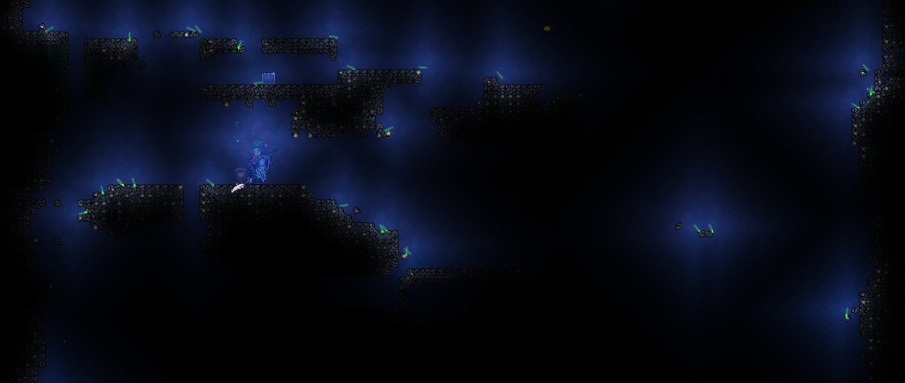
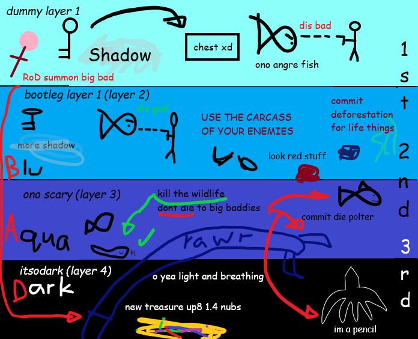

## Abyss (Trip Two)

* **Armor Sets:**

    * **Any class**: Reaver, Chlorophyte.

    * **Mage**: Spectre.

* **Required Items**: Pickaxe Axe/Drax, Shadow Key.

* **Helpful Other Items**: Strange Orb/Wisp In A Bottle/Lumenous Amulet, Anechoic Plating, Lead Boots, Depths Charm, Siren's Heart.

* **Accessible Layers**: 1-3.

* **What to do:**

    * The main goal of this visit should be to kill all the weak enemies and to get any shadow chests you missed. 
    * The planty mush/tenebris is mineable now with the Pickaxe Axe or any better pick, so that should be a goal too. 
    * Getting the new drops from the enemies can be used to craft a good amount of strong new weapons, and with planty mushes you can craft life fruits, which saves you from hours of farming for them (especially if you're in multiplayer).
    * Keep in mind to not go below 2nd layer, because most minibosses aren’t worth killing yet and they will interfere with Lumenyl/Depth Cells farming. 
    * Also using Rod of Discord is pretty much forbidden, unless you want to get your face ripped apart - it spawns an adult Eidolon Wyrm which is not meant to be fought. If you think it is - I have bad news for you.

